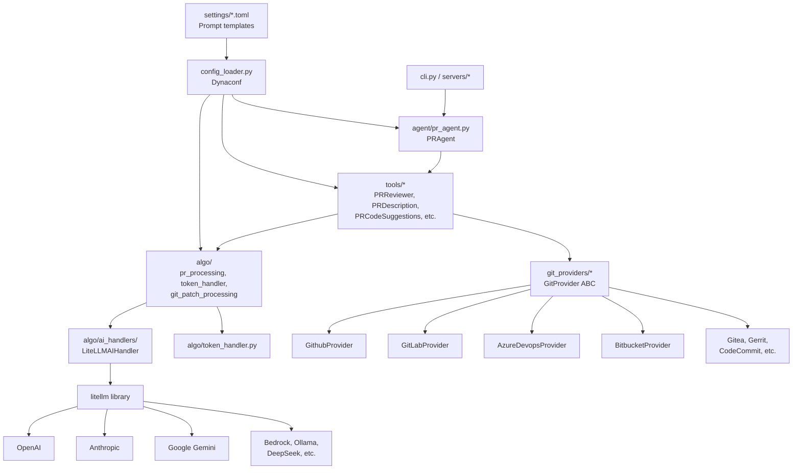

# PROJECT ANALYSIS REPORT
## Phân Tích Toàn Diện Source Code PR-Agent

> **Ngày phân tích:** 2026-08-28
> **Mục đích:** Đánh giá khả năng phát triển thành "Hệ thống quản lý Code Review và chất lượng Pull Request" (CodeGate / PRGuard)
> **Phương pháp:** Đọc trực tiếp source code, không dựa trên README hay suy đoán

---

## 1. Executive Summary

PR-Agent là một **AI bot chuyên review Pull Request** — một công cụ dòng lệnh và webhook server sử dụng LLM để phân tích diff của PR và sinh comment/review tự động. Nó **KHÔNG PHẢI** một nền tảng quản lý — không có database, không có dashboard, không có user/team management, không có quality score.

**Overall Match Score: 28/100**

Source hiện tại cung cấp nền tảng mạnh cho 3 trụ cột: **AI Code Review Engine**, **Git Provider Layer**, và **Webhook/CLI Infrastructure**. Tuy nhiên, ~70% các tính năng cần thiết cho đề tài hoàn toàn chưa tồn tại và phải xây mới từ đầu.

**Khuyến nghị:** Sử dụng repository này làm **engine bên trong một platform mới** (Option B).

---

## 2. Current Project Overview

### 2.1 Thông tin cơ bản

| Thuộc tính | Giá trị | Bằng chứng |
|---|---|---|
| **Tên project** | PR-Agent (The PR Agent) | [`action.yaml` L1](file:///F:/pr-agent/action.yaml) |
| **Mục đích chính** | AI-powered Pull Request review/description/suggestions | [`cli.py` L19](file:///F:/pr-agent/pr_agent/cli.py#L19): "AI based pull request analyzer" |
| **Vấn đề giải quyết** | Tự động hóa code review bằng AI cho PR | Toàn bộ `pr_agent/tools/` |
| **Đối tượng sử dụng** | Developers, DevOps teams, GitHub/GitLab administrators | - |
| **Loại project** | **CLI + Web Service (Webhook) + GitHub App + GitHub Action + AI Agent** | Xem phần 2.2 |
| **Database** | **KHÔNG CÓ** — Stateless, không có persistence | Không tìm thấy migration, ORM, hay database driver nào |
| **Frontend/Dashboard** | **KHÔNG CÓ** | Không tìm thấy HTML/CSS/JS/React/Vue nào |
| **Authentication/User management** | **KHÔNG CÓ** — Chỉ có identity provider cơ bản và webhook signature verification | [`identity_providers/`](file:///F:/pr-agent/pr_agent/identity_providers) |

### 2.2 Loại hình hoạt động

```
CLI                 → pr_agent/cli.py
GitHub App          → pr_agent/servers/github_app.py (FastAPI + Webhook)
GitHub Action       → pr_agent/servers/github_action_runner.py + action.yaml
GitLab Webhook      → pr_agent/servers/gitlab_webhook.py (FastAPI)
Bitbucket App       → pr_agent/servers/bitbucket_app.py
Bitbucket Server    → pr_agent/servers/bitbucket_server_webhook.py
Azure DevOps        → pr_agent/servers/azuredevops_server_webhook.py
Gerrit              → pr_agent/servers/gerrit_server.py
Gitea               → pr_agent/servers/gitea_app.py
GitHub Polling      → pr_agent/servers/github_polling.py
Mosaico (A2A Agent) → pr_agent/mosaico/server.py
```

**Evidence:**
- Docker multi-stage build: [`docker/Dockerfile`](file:///F:/pr-agent/docker/Dockerfile) — targets: `github_app`, `bitbucket_app`, `gitlab_webhook`, `azure_devops_webhook`, `gitea_app`, `github_polling`, `mosaico_agent`, `cli`, `test`
- GitHub Action: [`action.yaml`](file:///F:/pr-agent/action.yaml)
- CLI entry: [`pr_agent/cli.py` L165-166](file:///F:/pr-agent/pr_agent/cli.py#L165-L166)

### 2.3 Git Providers hiện hỗ trợ

| Provider | File | Class | Size |
|---|---|---|---|
| **GitHub** | [`github_provider.py`](file:///F:/pr-agent/pr_agent/git_providers/github_provider.py) | `GithubProvider` | 1636 lines |
| **GitLab** | [`gitlab_provider.py`](file:///F:/pr-agent/pr_agent/git_providers/gitlab_provider.py) | `GitLabProvider` | 1714 lines |
| **Bitbucket Cloud** | [`bitbucket_provider.py`](file:///F:/pr-agent/pr_agent/git_providers/bitbucket_provider.py) | `BitbucketProvider` | 732 lines |
| **Bitbucket Server** | [`bitbucket_server_provider.py`](file:///F:/pr-agent/pr_agent/git_providers/bitbucket_server_provider.py) | `BitbucketServerProvider` | ~700 lines |
| **Azure DevOps** | [`azuredevops_provider.py`](file:///F:/pr-agent/pr_agent/git_providers/azuredevops_provider.py) | `AzureDevopsProvider` | 1156 lines |
| **Gitea** | [`gitea_provider.py`](file:///F:/pr-agent/pr_agent/git_providers/gitea_provider.py) | `GiteaProvider` | ~1100 lines |
| **Gerrit** | [`gerrit_provider.py`](file:///F:/pr-agent/pr_agent/git_providers/gerrit_provider.py) | `GerritProvider` | ~380 lines |
| **AWS CodeCommit** | [`codecommit_provider.py`](file:///F:/pr-agent/pr_agent/git_providers/codecommit_provider.py) | `CodeCommitProvider` | ~500 lines |
| **Local Git** | [`local_git_provider.py`](file:///F:/pr-agent/pr_agent/git_providers/local_git_provider.py) | `LocalGitProvider` | ~320 lines |
| **Plain Diff** | [`plain_diff_provider.py`](file:///F:/pr-agent/pr_agent/git_providers/plain_diff_provider.py) | `PlainDiffGitProvider` | ~280 lines |

**Evidence:** Factory mapping in [`git_providers/__init__.py` L16-27](file:///F:/pr-agent/pr_agent/git_providers/__init__.py#L16-L27)

### 2.4 AI/LLM Providers hiện hỗ trợ

| Provider | Cơ chế | Bằng chứng |
|---|---|---|
| **OpenAI (GPT-3.5/4/4o/5.x/o-series)** | Via LiteLLM | [`algo/__init__.py` L1-57](file:///F:/pr-agent/pr_agent/algo/__init__.py#L1-L57) |
| **Anthropic Claude (3.x/4.x/5.x)** | Via LiteLLM | [`algo/__init__.py` L70-267](file:///F:/pr-agent/pr_agent/algo/__init__.py#L70-L267) |
| **Google Gemini** | Via LiteLLM (vertex_ai/ and gemini/) | [`algo/__init__.py` L104-146](file:///F:/pr-agent/pr_agent/algo/__init__.py#L104-L146) |
| **AWS Bedrock** | Via LiteLLM + boto3 IMDS support | [`litellm_ai_handler.py` L76-98](file:///F:/pr-agent/pr_agent/algo/ai_handlers/litellm_ai_handler.py#L76-L98) |
| **Azure OpenAI** | Via LiteLLM | `litellm_ai_handler.py` azure config |
| **DeepSeek** | Via LiteLLM | [`algo/__init__.py` L73-76](file:///F:/pr-agent/pr_agent/algo/__init__.py#L73-L76) |
| **Groq** | Via LiteLLM | [`algo/__init__.py` L271-280](file:///F:/pr-agent/pr_agent/algo/__init__.py#L271-L280) |
| **Ollama (Local)** | Via LiteLLM | [`algo/__init__.py` L298](file:///F:/pr-agent/pr_agent/algo/__init__.py#L298) |
| **WatsonX** | Via LiteLLM | [`algo/__init__.py` L299-304](file:///F:/pr-agent/pr_agent/algo/__init__.py#L299-L304) |
| **xAI Grok** | Via LiteLLM | [`algo/__init__.py` L287-297](file:///F:/pr-agent/pr_agent/algo/__init__.py#L287-L297) |
| **Mistral** | Via LiteLLM | [`algo/__init__.py` L308-321](file:///F:/pr-agent/pr_agent/algo/__init__.py#L308-L321) |
| **OpenRouter** | Via LiteLLM + config | [`configuration.toml` L406-425](file:///F:/pr-agent/pr_agent/settings/configuration.toml#L406-L425) |
| **SambaNova** | Via LiteLLM | [`algo/__init__.py` L281-286](file:///F:/pr-agent/pr_agent/algo/__init__.py#L281-L286) |
| **LangChain** | Optional handler | [`langchain_ai_handler.py`](file:///F:/pr-agent/pr_agent/algo/ai_handlers/langchain_ai_handler.py) |

**Core abstraction:** [`BaseAiHandler`](file:///F:/pr-agent/pr_agent/algo/ai_handlers/base_ai_handler.py) → [`LiteLLMAIHandler`](file:///F:/pr-agent/pr_agent/algo/ai_handlers/litellm_ai_handler.py) (1098 lines, primary implementation)

---

## 3. Architecture

### 3.1 Cấu trúc Source Code

```
pr-agent/
├── pr_agent/                          # Main Python package
│   ├── agent/
│   │   └── pr_agent.py               # Central orchestrator — PRAgent class, command routing
│   ├── algo/                          # Core algorithms
│   │   ├── __init__.py                # MAX_TOKENS map for 100+ models, model lists
│   │   ├── ai_handlers/              # AI/LLM abstraction layer
│   │   │   ├── base_ai_handler.py    # ABC interface for AI handlers
│   │   │   ├── litellm_ai_handler.py # Primary handler (LiteLLM), 1098 lines
│   │   │   ├── openai_ai_handler.py  # Direct OpenAI handler (legacy)
│   │   │   ├── langchain_ai_handler.py # LangChain handler (optional)
│   │   │   └── litellm_helpers.py    # Streaming, callbacks, Azure AD
│   │   ├── pr_processing.py          # Diff generation, token budgeting, multi-model fallback
│   │   ├── git_patch_processing.py   # Patch/hunk processing, line numbers
│   │   ├── token_handler.py          # Token counting (tiktoken, Claude API)
│   │   ├── file_filter.py            # File ignore/include logic
│   │   ├── language_handler.py       # Language detection, file validation
│   │   ├── utils.py                  # 84KB of utilities (YAML parsing, markdown, etc.)
│   │   ├── inline_comment_dedup.py   # Deduplication of inline comments
│   │   ├── repo_context.py           # Repository context (AGENTS.md etc.)
│   │   ├── run_details.py            # Run telemetry (model, tokens, cost)
│   │   ├── skills_loader.py          # Custom skills (SKILL.md) loading
│   │   └── types.py                  # FilePatchInfo, EDIT_TYPE
│   ├── git_providers/                 # Git platform integrations (10 providers)
│   │   ├── git_provider.py           # GitProvider ABC — 635 lines, 30+ abstract/virtual methods
│   │   ├── github_provider.py        # 1636 lines — most complete implementation
│   │   ├── gitlab_provider.py        # 1714 lines
│   │   ├── azuredevops_provider.py   # 1156 lines
│   │   ├── bitbucket_provider.py     # 732 lines
│   │   ├── bitbucket_server_provider.py
│   │   ├── gitea_provider.py         # 1100+ lines
│   │   ├── gerrit_provider.py
│   │   ├── codecommit_provider.py
│   │   ├── local_git_provider.py
│   │   ├── plain_diff_provider.py
│   │   ├── diff_parsing.py
│   │   └── utils.py                  # apply_repo_settings, size validation
│   ├── tools/                         # Command implementations (one tool = one command)
│   │   ├── pr_reviewer.py            # /review — 687 lines, core review tool
│   │   ├── pr_code_suggestions.py    # /improve — 1423 lines, code suggestions
│   │   ├── pr_description.py         # /describe — 1040 lines, PR description
│   │   ├── pr_questions.py           # /ask — Q&A on PR
│   │   ├── pr_line_questions.py      # /ask_line — line-specific Q&A
│   │   ├── pr_add_docs.py            # /add_docs — docstring generation
│   │   ├── pr_update_changelog.py    # /update_changelog
│   │   ├── pr_generate_labels.py     # /generate_labels
│   │   ├── pr_similar_issue.py       # /similar_issue (vector DB)
│   │   ├── pr_config.py              # /config — show configuration
│   │   ├── pr_help_message.py        # /help
│   │   ├── pr_help_docs.py           # /help_docs (disabled for security)
│   │   ├── ticket_pr_compliance_check.py # Ticket compliance checking
│   │   └── progress_comment.py       # Progress comment builder
│   ├── servers/                       # Webhook/server entry points
│   │   ├── github_app.py             # FastAPI GitHub App webhook handler
│   │   ├── github_action_runner.py   # GitHub Action runner
│   │   ├── github_polling.py         # Polling-based GitHub integration
│   │   ├── gitlab_webhook.py         # FastAPI GitLab webhook
│   │   ├── bitbucket_app.py          # Bitbucket Cloud webhook
│   │   ├── bitbucket_server_webhook.py
│   │   ├── azuredevops_server_webhook.py
│   │   ├── gitea_app.py
│   │   ├── gerrit_server.py
│   │   ├── github_lambda_webhook.py  # AWS Lambda handler
│   │   ├── gitlab_lambda_webhook.py
│   │   ├── gunicorn_config.py        # Production server config
│   │   ├── help.py                   # Help message builder
│   │   └── utils.py                  # Signature verification, rate limiting
│   ├── settings/                      # Configuration & prompt templates (TOML)
│   │   ├── configuration.toml        # 506 lines — all config options
│   │   ├── pr_reviewer_prompts.toml  # Review prompt templates (Jinja2)
│   │   ├── pr_description_prompts.toml
│   │   ├── code_suggestions/         # Suggestion prompt templates
│   │   ├── language_extensions.toml  # File extension→language mapping
│   │   ├── .secrets_template.toml    # Secrets template
│   │   └── [other prompt files]
│   ├── identity_providers/            # User identity (minimal)
│   ├── secret_providers/              # Secret management (AWS SM, GCS)
│   ├── mosaico/                       # A2A (Agent-to-Agent) protocol support
│   ├── log/                           # Loguru-based logging
│   ├── config_loader.py              # Dynaconf configuration loading
│   ├── cli.py                        # CLI entry point
│   └── cli_pip.py                    # Alternative pip CLI
├── docker/
│   └── Dockerfile                    # Multi-stage: github_app, gitlab_webhook, cli, test, etc.
├── github_action/
│   └── entrypoint.sh
├── tests/
│   ├── unittest/                     # 144 unit test files
│   ├── e2e_tests/
│   └── health_test/
├── docs/                             # MkDocs documentation
├── action.yaml                       # GitHub Action definition
├── requirements.txt                  # 57 dependencies
└── pyproject.toml                    # Build config (Python ≥3.12)
```

### 3.2 Dependency Graph



---

## 4. PR Processing Flow (Thực tế từ Source)

### 4.1 Luồng chính: `/review` command

```
┌─────────────────────────────┐
│ TRIGGER                      │
│ - GitHub Webhook (PR event)  │  servers/github_app.py::handle_github_webhooks()
│ - CLI command                │  cli.py::run()
│ - GitHub Action              │  servers/github_action_runner.py
│ - GitLab Webhook             │  servers/gitlab_webhook.py
└──────────┬──────────────────┘
           │
           ▼
┌─────────────────────────────┐
│ AGENT ROUTING                │
│ PRAgent._handle_request()    │  agent/pr_agent.py L163
│ - apply_repo_settings()      │  git_providers/utils.py
│ - Parse command + args       │
│ - Validate CLI args          │
│ - command2class lookup       │  agent/pr_agent.py L24-46
└──────────┬──────────────────┘
           │ command = "review"
           ▼
┌─────────────────────────────┐
│ TOOL INITIALIZATION          │
│ PRReviewer.__init__()        │  tools/pr_reviewer.py L51
│ - get_git_provider_with_     │  git_providers/__init__.py L46
│   context(pr_url)            │
│ - get_main_pr_language()     │  git_providers/git_provider.py L552
│ - get_pr_description()       │
│ - Build vars dict            │  tools/pr_reviewer.py L94-121
│ - TokenHandler init          │  algo/token_handler.py L42
└──────────┬──────────────────┘
           │
           ▼
┌─────────────────────────────┐
│ PR REVIEWER RUN              │
│ PRReviewer.run()             │  tools/pr_reviewer.py L139
│ - extract_and_cache_tickets()│  tools/ticket_pr_compliance_check.py
│ - retry_with_fallback_models │  algo/pr_processing.py
│   (self._prepare_prediction) │
└──────────┬──────────────────┘
           │
           ▼
┌─────────────────────────────┐
│ PREPARE PREDICTION           │
│ _prepare_prediction(model)   │  tools/pr_reviewer.py L245
│ - get_pr_diff()              │  algo/pr_processing.py L46
│   ├─ git_provider.get_diff() │  git_providers/github_provider.py
│   ├─ filter_ignored()        │  algo/file_filter.py
│   ├─ extend_patch()          │  algo/git_patch_processing.py
│   ├─ Token budgeting         │  algo/pr_processing.py
│   └─ Compress if too large   │
└──────────┬──────────────────┘
           │
           ▼
┌─────────────────────────────┐
│ AI PREDICTION                │
│ _get_prediction(model)       │  tools/pr_reviewer.py L265
│ - Render Jinja2 prompts      │  settings/pr_reviewer_prompts.toml
│   (system + user)            │
│ - ai_handler.chat_completion │  algo/ai_handlers/litellm_ai_handler.py
│   (model, system, user)      │
│ - Return raw AI response     │
└──────────┬──────────────────┘
           │
           ▼
┌─────────────────────────────┐
│ PROCESS & PUBLISH            │
│ _prepare_pr_review()         │  tools/pr_reviewer.py L291
│ - load_yaml(prediction)      │  Parse YAML from AI response
│ - github_action_output()     │  Output for GH Action
│ - Inline key issues          │  _publish_key_issues_as_inline_comments()
│ - convert_to_markdown_v2()   │  algo/utils.py
│ - set_review_labels()        │  Effort + security labels
│ - publish_persistent_comment │  git_providers/git_provider.py L399
│   OR publish_comment()       │  git_providers/github_provider.py
└─────────────────────────────┘
```

### 4.2 Key modules per step

| Step | Module | File | Key Function/Class |
|---|---|---|---|
| Entry (CLI) | cli | [`cli.py`](file:///F:/pr-agent/pr_agent/cli.py) | `run()` |
| Entry (Webhook) | servers | [`github_app.py`](file:///F:/pr-agent/pr_agent/servers/github_app.py) | `handle_github_webhooks()` |
| Routing | agent | [`pr_agent.py`](file:///F:/pr-agent/pr_agent/agent/pr_agent.py) | `PRAgent._handle_request()` |
| Settings | config | [`config_loader.py`](file:///F:/pr-agent/pr_agent/config_loader.py) | `get_settings()` |
| Repo Settings | git_providers | [`utils.py`](file:///F:/pr-agent/pr_agent/git_providers/utils.py) | `apply_repo_settings()` |
| Tool Execution | tools | [`pr_reviewer.py`](file:///F:/pr-agent/pr_agent/tools/pr_reviewer.py) | `PRReviewer.run()` |
| Diff Generation | algo | [`pr_processing.py`](file:///F:/pr-agent/pr_agent/algo/pr_processing.py) | `get_pr_diff()` |
| Patch Processing | algo | [`git_patch_processing.py`](file:///F:/pr-agent/pr_agent/algo/git_patch_processing.py) | `extend_patch()` |
| Token Management | algo | [`token_handler.py`](file:///F:/pr-agent/pr_agent/algo/token_handler.py) | `TokenHandler.count_tokens()` |
| AI Call | algo/ai_handlers | [`litellm_ai_handler.py`](file:///F:/pr-agent/pr_agent/algo/ai_handlers/litellm_ai_handler.py) | `LiteLLMAIHandler.chat_completion()` |
| Output Formatting | algo | [`utils.py`](file:///F:/pr-agent/pr_agent/algo/utils.py) | `convert_to_markdown_v2()` |
| Publishing | git_providers | [`github_provider.py`](file:///F:/pr-agent/pr_agent/git_providers/github_provider.py) | `publish_comment()`, `publish_inline_comments()` |

---

## 5. Current Features Inventory

### 5.1 Pull Request Features

| Tính năng | Có | Có một phần | Chưa có | File/module | Nhận xét |
|---|:---:|:---:|:---:|---|---|
| Nhận Pull Request | ✅ | | | `servers/github_app.py`, `cli.py` | Via webhook, CLI, GitHub Action |
| Đọc PR metadata | ✅ | | | `git_providers/github_provider.py` | Title, branch, description, labels |
| Đọc changed files | ✅ | | | `GitProvider.get_files()`, `get_diff_files()` | |
| Đọc commits | ✅ | | | `GitProvider.get_commit_messages()` | |
| Đọc diff | ✅ | | | `algo/pr_processing.py::get_pr_diff()` | Extended patch with context |
| Xử lý PR lớn | ✅ | | | `algo/pr_processing.py` | Token budgeting, compression, multi-diff |
| Phân tích chỉ changed code | ✅ | | | `algo/git_patch_processing.py` | Focus on + lines |
| PR summary | ✅ | | | `tools/pr_description.py` | AI-generated summary |
| PR description | ✅ | | | `tools/pr_description.py` | Updates PR title + body |
| PR review | ✅ | | | `tools/pr_reviewer.py` | Key issues, effort, security |
| Code suggestion | ✅ | | | `tools/pr_code_suggestions.py` | Committable suggestions |
| Inline comment | ✅ | | | `GitProvider.publish_inline_comments()` | |
| Review comment | ✅ | | | `GitProvider.publish_comment()` | Persistent comments |
| Q&A on PR | ✅ | | | `tools/pr_questions.py`, `pr_line_questions.py` | |

### 5.2 Git Integration Features

| Tính năng | Có | Có một phần | Chưa có | File/module | Nhận xét |
|---|:---:|:---:|:---:|---|---|
| GitHub | ✅ | | | `github_provider.py` (1636 lines) | Most complete |
| GitLab | ✅ | | | `gitlab_provider.py` (1714 lines) | Very complete |
| Bitbucket | ✅ | | | `bitbucket_provider.py` (732 lines) | Cloud + Server |
| Azure DevOps | ✅ | | | `azuredevops_provider.py` (1156 lines) | |
| Gitea | ✅ | | | `gitea_provider.py` (~1100 lines) | |
| Gerrit | | ✅ | | `gerrit_provider.py` (~380 lines) | Basic |
| Webhook | ✅ | | | `servers/` | All major providers |
| GitHub Action | ✅ | | | `action.yaml`, `github_action_runner.py` | |
| GitHub Checks | ✅ | | | `github_provider.py` publish_as_check_run | Optional |
| CI/CD integration | | ✅ | | Via GitHub Action, webhook | Not a full CI/CD system |

### 5.3 AI Features

| Tính năng | Có | Có một phần | Chưa có | File/module | Nhận xét |
|---|:---:|:---:|:---:|---|---|
| LLM abstraction | ✅ | | | `algo/ai_handlers/base_ai_handler.py` | Clean ABC |
| OpenAI | ✅ | | | Via LiteLLM | GPT-3.5 through GPT-5.6 |
| Claude | ✅ | | | Via LiteLLM | Extended thinking support |
| Gemini | ✅ | | | Via LiteLLM | Vertex AI + direct |
| Local model | ✅ | | | Via LiteLLM (ollama/) | |
| Prompt templates | ✅ | | | `settings/*.toml` | Jinja2, YAML output |
| Token management | ✅ | | | `algo/token_handler.py` | tiktoken + Claude API |
| Large diff handling | ✅ | | | `algo/pr_processing.py` | Compression, multi-call, budgeting |
| AI review | ✅ | | | `tools/pr_reviewer.py` | |
| AI suggestion | ✅ | | | `tools/pr_code_suggestions.py` | |
| AI summary | ✅ | | | `tools/pr_description.py` | |

### 5.4 Code Quality Features

| Tính năng | Có | Có một phần | Chưa có | File/module | Nhận xét |
|---|:---:|:---:|:---:|---|---|
| Lint | | | ❌ | NOT FOUND | No linter integration |
| Static analysis | | | ❌ | NOT FOUND | No static analysis tools |
| Security scan | | ✅ | | `pr_reviewer_prompts.toml` L152 | AI-based only, no dedicated scanner |
| Complexity | | | ❌ | NOT FOUND | No complexity analysis |
| Maintainability | | | ❌ | NOT FOUND | |
| Test execution | | | ❌ | NOT FOUND | Does not run tests |
| Test result | | | ❌ | NOT FOUND | |
| Coverage | | | ❌ | NOT FOUND | No coverage integration |
| Code smell | | ✅ | | Via AI review | AI detects issues, not formal code smell detection |
| Bug detection | | ✅ | | `pr_reviewer_prompts.toml` "Possible Bug" | AI-based only |

### 5.5 Management Features

| Tính năng | Có | Có một phần | Chưa có | File/module | Nhận xét |
|---|:---:|:---:|:---:|---|---|
| User management | | | ❌ | NOT FOUND | |
| Team management | | | ❌ | NOT FOUND | |
| Repository management | | | ❌ | NOT FOUND | |
| Pull Request management | | | ❌ | NOT FOUND | Only processes individual PRs |
| Reviewer management | | | ❌ | NOT FOUND | |
| Review assignment | | | ❌ | NOT FOUND | |
| Roles/permissions | | | ❌ | NOT FOUND | |
| Authentication | | ✅ | | `identity_providers/`, webhook signatures | Only API token auth |
| Database | | | ❌ | NOT FOUND | Completely stateless |
| Analysis history | | | ❌ | NOT FOUND | No persistence |
| Audit log | | | ❌ | NOT FOUND | Only runtime logs |

### 5.6 Scoring Features

| Tính năng | Có | Có một phần | Chưa có | File/module | Nhận xét |
|---|:---:|:---:|:---:|---|---|
| Quality Score | | ✅ | | `pr_reviewer_prompts.toml` L142 | Optional 0-100, AI-generated, not persisted |
| Risk Score | | | ❌ | NOT FOUND | |
| Security Score | | ✅ | | Security concerns yes/no | Binary, not scored |
| Complexity Score | | | ❌ | NOT FOUND | |
| Testing Score | | | ❌ | NOT FOUND | |
| Maintainability Score | | | ❌ | NOT FOUND | |

### 5.7 Decision Features

| Tính năng | Có | Có một phần | Chưa có | File/module | Nhận xét |
|---|:---:|:---:|:---:|---|---|
| Quality Policy | | | ❌ | NOT FOUND | |
| Repository-specific rule | | ✅ | | `.pr_agent.toml`, repo settings | Config only, not policy engine |
| Merge recommendation | | | ❌ | NOT FOUND | |
| Merge Quality Gate | | | ❌ | NOT FOUND | |
| Block merge | | | ❌ | NOT FOUND | |
| Required reviewers | | | ❌ | NOT FOUND | |

### 5.8 Analytics Features

| Tính năng | Có | Có một phần | Chưa có | File/module | Nhận xét |
|---|:---:|:---:|:---:|---|---|
| Dashboard | | | ❌ | NOT FOUND | |
| Repository analytics | | | ❌ | NOT FOUND | |
| PR analytics | | | ❌ | NOT FOUND | |
| Quality trend | | | ❌ | NOT FOUND | |
| Risk trend | | | ❌ | NOT FOUND | |
| Developer/team metrics | | | ❌ | NOT FOUND | |
| Reviewer metrics | | | ❌ | NOT FOUND | |
| Historical statistics | | | ❌ | NOT FOUND | |

---

## 6. AI Code Review Engine — Deep Analysis

### 6.1 Review Class

```
File:       pr_agent/tools/pr_reviewer.py
Class:      PRReviewer
Purpose:    Orchestrate AI review of a PR — get diff, call AI, parse response, publish
Reusable:   YES (with adapter pattern)
Difficulty: MEDIUM — well-structured but tightly coupled to git_provider
```

### 6.2 Prompt System

```
File:       pr_agent/settings/pr_reviewer_prompts.toml
Format:     Jinja2 templates with YAML output schema
System:     Detailed review instructions + Pydantic schema definition
User:       PR info (title, branch, description, diff) + ticket info
Output:     YAML matching PRReview Pydantic model
```

Key prompt features (from [`pr_reviewer_prompts.toml`](file:///F:/pr-agent/pr_agent/settings/pr_reviewer_prompts.toml)):
- **Severity guidance** (L49-61): Clear rules on when to flag vs. skip
- **Structured output** (L91-163): Pydantic model defines: estimated effort, security concerns, key issues, ticket compliance, can-be-split, TODO scan, contribution time cost
- **issue_header** (L101): Categories like "Possible Bug", etc.
- **start_line/end_line** (L103-104): Precise code location references

### 6.3 Diff Pipeline

```
File:       pr_agent/algo/pr_processing.py
Function:   get_pr_diff()
Purpose:    Get diff from git provider, extend patches, manage token budget
```

Flow:
1. `git_provider.get_diff_files()` → List[FilePatchInfo]
2. `filter_ignored()` → Remove ignored files
3. `sort_files_by_main_languages()` → Prioritize main language files
4. `pr_generate_extended_diff()` → Extend patches with context
5. Token budgeting → Fit within model limits
6. Compression if needed → `pr_generate_compressed_diff()`

### 6.4 LLM Call

```
File:       pr_agent/algo/ai_handlers/litellm_ai_handler.py
Class:      LiteLLMAIHandler
Function:   chat_completion(model, system, user, temperature)
Purpose:    Call LLM via LiteLLM with retry, streaming, reasoning effort
```

### 6.5 Response Parsing

```
File:       pr_agent/algo/utils.py
Function:   load_yaml()
Purpose:    Parse YAML response from AI, with error correction
```

### 6.6 Comment Publishing

```
File:       pr_agent/git_providers/github_provider.py (and others)
Functions:  publish_comment(), publish_inline_comments(), publish_code_suggestions()
```

### 6.7 Review Output Structure

| Feature | Present | Evidence |
|---|:---:|---|
| Confidence score | ❌ | NOT FOUND in prompts or code |
| Severity | ✅ | `issue_header` field ("Possible Bug", etc.) |
| Category/issue type | ✅ | `issue_header` field |
| Structured JSON/YAML output | ✅ | YAML schema in `pr_reviewer_prompts.toml` L91-163 |
| Effort estimate | ✅ | `estimated_effort_to_review_[1-5]` |
| Security concerns | ✅ | `security_concerns` field |
| Key issues list | ✅ | `key_issues_to_review` with file/line references |

### 6.8 Reusability Assessment

```
Reusable as independent module: PARTIALLY
Reason: The AI review engine works through prompt→LLM→YAML→markdown pipeline.
        The core logic (prompt rendering, LLM call, YAML parsing) can be extracted.
        But it's currently coupled to the publishing layer.
Difficulty to extract: MEDIUM (3-4 effort units)
```

---

## 7. Git Provider Layer — Deep Analysis

### 7.1 Interface Definition

[`GitProvider`](file:///F:/pr-agent/pr_agent/git_providers/git_provider.py#L117) (ABC) defines 30+ methods:

| API Method | Abstract | Purpose |
|---|:---:|---|
| `get_files()` | ✅ | List changed files |
| `get_diff_files()` | ✅ | Get FilePatchInfo list with patches |
| `get_languages()` | ✅ | Repository language stats |
| `get_pr_branch()` | ✅ | Source branch |
| `get_user_id()` | ✅ | Current user |
| `get_pr_description_full()` | ✅ | Full PR description |
| `get_commit_messages()` | ✅ | Commit messages |
| `publish_description()` | ✅ | Update PR title/body |
| `publish_comment()` | ✅ | Post comment |
| `publish_inline_comment()` | ✅ | Post inline comment |
| `publish_inline_comments()` | ✅ | Post batch inline comments |
| `publish_code_suggestions()` | ✅ | Post code suggestions |
| `publish_labels()` | ✅ | Set PR labels |
| `get_pr_labels()` | ✅ | Get current labels |
| `get_issue_comments()` | ✅ | List issue comments |
| `remove_comment()` | ✅ | Delete comment |
| `remove_initial_comment()` | ✅ | Remove progress comment |
| `add_eyes_reaction()` | ✅ | Add 👀 reaction |
| `remove_reaction()` | ✅ | Remove reaction |
| `get_repo_settings()` | ✅ | Load .pr_agent.toml |
| `get_incremental_commits()` | Virtual | Incremental review support |
| `publish_persistent_comment()` | Virtual | Update-in-place comments |
| `auto_approve()` | Virtual | Auto-approve PR |
| `get_line_link()` | Virtual | Link to specific line |
| `clone()` | Virtual | Clone repository |
| `get_repo_file_content()` | Virtual | Read file from repo |

### 7.2 Provider Implementation Completeness

| API | GitHub | GitLab | Bitbucket | Azure DevOps | Gitea |
|---|:---:|:---:|:---:|:---:|:---:|
| get_diff_files | ✅ | ✅ | ✅ | ✅ | ✅ |
| publish_comment | ✅ | ✅ | ✅ | ✅ | ✅ |
| publish_inline_comments | ✅ | ✅ | ✅ | ✅ | ✅ |
| publish_code_suggestions | ✅ | ✅ | ✅ | ✅ | ✅ |
| publish_labels | ✅ | ✅ | ✅ | ✅ | ✅ |
| get_issue_comments | ✅ | ✅ | ✅ | ✅ | ✅ |
| publish_persistent_comment | ✅ | ✅ | ✅ | ✅ | ✅ |
| incremental_commits | ✅ | ✅ | ❌ | ✅ | ❌ |
| auto_approve | ✅ | ✅ | ❌ | ❌ | ❌ |
| clone | ✅ | ✅ | ✅ | ✅ | ✅ |
| get_repo_file_content | ✅ | ✅ | ✅ | ✅ | ✅ |

### 7.3 Assessment

> **Có thể sử dụng nguyên layer này cho hệ thống mới không?**
>
> **CÓ — Đây là thành phần có giá trị cao nhất của repository.** 5 provider lớn (GitHub, GitLab, Bitbucket, Azure DevOps, Gitea) đều đã implemented chi tiết. Interface `GitProvider` có thể mở rộng thêm methods cho management features mới mà không phá vỡ backward compatibility.

---

## 8. Reusable Components Assessment

| Component | Giữ nguyên | Sửa nhẹ | Refactor | Thay thế | Lý do |
|---|---:|---:|---:|---:|---|
| Git Provider Layer | ✅ | | | | Mature, 10 providers, excellent abstraction |
| AI Handler (LiteLLM) | ✅ | | | | Supports 40+ models, streaming, retry |
| Prompt Templates | | ✅ | | | Good but need new prompts for quality/risk |
| Token Handler | ✅ | | | | Well-tested, multi-model |
| PR Processing (diff) | ✅ | | | | Token budgeting, patch extension |
| PRReviewer Tool | | ✅ | | | Core logic good, needs integration points |
| PRDescription Tool | | ✅ | | | Same |
| PRCodeSuggestions | | ✅ | | | Same |
| CLI | | | ✅ | | Needs complete redesign for platform CLI |
| Servers (Webhook) | | ✅ | | | Good base, need management API on top |
| Config System (Dynaconf) | ✅ | | | | Flexible, TOML-based |
| Identity Providers | | | | ✅ | Too minimal, need full auth system |
| Secret Providers | ✅ | | | | AWS SM, GCS working |
| Log System | ✅ | | | | Loguru, structured logging |
| File Filter | ✅ | | | | |
| Language Handler | ✅ | | | | |

### Classification

#### A. KEEP — Giữ nguyên

- `algo/ai_handlers/` — AI abstraction + LiteLLM handler
- `algo/__init__.py` — Model token limits
- `algo/token_handler.py` — Token counting
- `algo/pr_processing.py` — Diff generation pipeline
- `algo/git_patch_processing.py` — Patch processing
- `algo/file_filter.py` — File filtering
- `algo/language_handler.py` — Language detection
- `algo/types.py` — Core types
- `git_providers/git_provider.py` — GitProvider ABC
- `git_providers/github_provider.py` — GitHub implementation
- `git_providers/gitlab_provider.py` — GitLab implementation
- `git_providers/azuredevops_provider.py` — Azure DevOps
- `git_providers/bitbucket_provider.py` — Bitbucket
- `git_providers/gitea_provider.py` — Gitea
- `config_loader.py` — Dynaconf config system
- `log/` — Logging
- `secret_providers/` — Secret management

#### B. EXTEND — Cần thêm chức năng

- `tools/pr_reviewer.py` — Add quality/risk scoring hooks
- `tools/pr_code_suggestions.py` — Add suggestion tracking
- `tools/pr_description.py` — Add analysis metadata output
- `servers/github_app.py` — Add management API endpoints
- `settings/configuration.toml` — Add new config sections
- `settings/pr_reviewer_prompts.toml` — Add quality-focused prompts

#### C. REFACTOR — Cần thay đổi architecture

- `agent/pr_agent.py` — Needs to support management commands beyond PR tools
- `cli.py` — Needs redesign for platform management CLI

#### D. REMOVE — Không cần cho sản phẩm mới

- `tools/pr_similar_issue.py` — Vector DB search, not relevant to quality management
- `tools/pr_help_docs.py` — Documentation helper, not core
- `mosaico/` — A2A protocol, specialized use case

---

## 9. Requirements Mapping

| Yêu cầu đề tài | Đáp ứng (%) | Thành phần hiện có | Thành phần còn thiếu |
|---|---:|---|---|
| AI Code Review | 75% | PRReviewer, AI handlers, prompts, diff processing | Structured finding storage, severity taxonomy |
| Git Integration | 90% | 10 providers, webhooks, GitHub Action | None significant |
| PR Processing | 80% | Diff, patch, token budgeting, large PR handling | PR lifecycle management, status tracking |
| Code Suggestions | 70% | PRCodeSuggestions, committable suggestions | Suggestion tracking, acceptance rate |
| PR Description | 80% | PRDescription, labels, changelog | N/A |
| Code Quality Analysis | 5% | AI-based review only | Static analysis, lint, complexity, maintainability |
| Security Analysis | 10% | AI security concerns (yes/no) | Dedicated security scanner, vulnerability DB |
| Testing/Coverage | 0% | NOT FOUND | Test execution, coverage collection, result parsing |
| Risk Assessment | 0% | NOT FOUND | Risk scoring engine, factors, thresholds |
| Reviewer Management | 0% | NOT FOUND | Reviewer DB, assignment, recommendations |
| Quality Gate | 0% | NOT FOUND | Policy engine, merge blocking |
| Dashboard | 0% | NOT FOUND | Web frontend, visualization |
| Analytics | 0% | NOT FOUND | Time series, aggregation, trends |
| Database/Persistence | 0% | NOT FOUND | ORM, migration, models |
| User/Team Management | 0% | NOT FOUND | Auth, RBAC, team structure |
| Quality Score | 10% | Optional PR score (0-100, AI-generated) | Composite multi-factor score, persistence |

### Category Scores

| Category | Score | Justification |
|---|---:|---|
| 1. Code Review Management | 15% | Has AI review, but no management — no tracking, history, assignment |
| 2. Pull Request Management | 10% | Processes PRs but doesn't manage them |
| 3. AI Code Review | 75% | Strong AI pipeline, many models, good prompts |
| 4. Code Quality Analysis | 5% | AI-based only, no static analysis tools |
| 5. PR Quality Management | 5% | No quality framework beyond AI review output |
| 6. Security | 10% | AI security scan only, binary yes/no |
| 7. Testing/Coverage | 0% | Nothing |
| 8. Risk Assessment | 0% | Nothing |
| 9. Reviewer Management | 0% | Nothing |
| 10. Quality Gate | 0% | Nothing |
| 11. Dashboard | 0% | Nothing |
| 12. Analytics | 0% | Nothing |

# OVERALL MATCH SCORE: 28/100

**Explanation:** The repository excels at its original purpose (AI-powered PR review bot) but the target product is a **management platform**. The AI review engine (~75% match) and git provider layer (~90% match) are excellent foundations, but they represent only ~25-30% of the total scope. The remaining 70% (management, persistence, dashboard, analytics, quality/risk engines, policies) must be built from scratch.

---

## 10. Gap Analysis

### Critical Missing Features

These are **mandatory** for the product to qualify as "Hệ thống quản lý Code Review và chất lượng Pull Request":

1. **Persistent Database** — No data survives between runs. Cannot track history, trends, or manage anything.
2. **User/Team/Repository Management** — No concept of users, teams, or managed repositories.
3. **Quality Score Engine** — The optional AI score is not a composite quality metric.
4. **Risk Score Engine** — Completely absent.
5. **Dashboard/Web UI** — No visual interface.
6. **Management API** — Current API is webhook-only, not a management REST API.
7. **PR Lifecycle Management** — Cannot track PR status, history, or aggregate data.

### Important Missing Features

8. **Static Analysis Integration** — No Ruff, Bandit, Semgrep, etc.
9. **Security Analysis** — Only AI yes/no, not vulnerability scanning.
10. **Test/Coverage Integration** — No connection to test frameworks or coverage tools.
11. **Quality Policy Engine** — No configurable rules or merge gates.
12. **Reviewer Recommendation Engine** — Cannot suggest reviewers.
13. **Analytics & Trends** — No time-series analysis of quality.
14. **Complexity Analysis** — No complexity metrics (cyclomatic, cognitive, etc.).

### Nice-to-have Features

15. **Merge Quality Gate** — Block merge based on quality threshold.
16. **Audit Log** — Track all system actions.
17. **Notification System** — Beyond Git platform comments.
18. **Multi-tenant Support** — For SaaS deployment.
19. **Plugin System** — For custom analyzers.
20. **Report Generation** — PDF/export of quality reports.

---

## 11. Quality Engine Proposal

### Proposed Architecture

```
QualityEngine
├── Input
│   ├── AI Review Findings (from PRReviewer)
│   ├── Static Analysis Results (from new StaticAnalysisRunner)
│   ├── Security Scan Results (from new SecurityScanner)
│   ├── Complexity Metrics (from new ComplexityAnalyzer)
│   ├── Test Results (from new TestRunner)
│   └── Coverage Data (from new CoverageCollector)
├── Processing
│   ├── Normalize scores to 0-100 per dimension
│   ├── Apply configurable weights
│   └── Compute composite score
└── Output
    ├── QualityScore (0-100)
    ├── Dimension scores (code_quality, security, testing, complexity, maintainability, ai_findings)
    ├── Grade (A-F)
    └── Pass/Fail against policy threshold
```

### Integration Point

```
Recommended package: pr_agent/engines/quality_engine.py

Called by:
  - New PR analysis pipeline (after all analyzers complete)
  - Management API endpoints
  - Quality Policy engine

Depends on:
  - PRReviewer output (existing)
  - Static analysis module (new)
  - Security scan module (new)
  - Test/coverage module (new)
```

### Score Formula (Proposed)

```
Quality Score = Σ (weight_i × dimension_score_i)

Dimensions:
  code_quality      (weight: 0.25) — AI findings severity + count
  security          (weight: 0.20) — Security vulnerabilities found
  testing           (weight: 0.20) — Test presence + coverage delta
  complexity        (weight: 0.15) — Cyclomatic/cognitive complexity delta
  maintainability   (weight: 0.10) — Code style, doc coverage, DRY
  ai_review         (weight: 0.10) — AI review effort estimate + issues
```

---

## 12. Risk Engine Proposal

### Risk Score = 0–100

| Factor | Weight | Data Available in Current Source? | Source |
|---|---|---|---|
| Lines changed | 0.15 | ✅ YES | `git_provider.get_diff_files()` → patch size |
| Files changed | 0.10 | ✅ YES | `git_provider.get_num_of_files()` |
| Critical files modified | 0.15 | ❌ NO | Needs critical file registry |
| Complexity delta | 0.10 | ❌ NO | Needs complexity analyzer |
| Security findings | 0.15 | ✅ PARTIAL | AI security scan |
| Coverage delta | 0.10 | ❌ NO | Needs coverage integration |
| Repository history | 0.05 | ❌ NO | Needs persistent DB |
| Previous bugs in files | 0.05 | ❌ NO | Needs bug tracking integration |
| Developer experience | 0.05 | ❌ NO | Needs git history analysis |
| AI findings severity | 0.10 | ✅ PARTIAL | AI review output |

### Integration Point

```
Recommended package: pr_agent/engines/risk_engine.py

Input: AnalysisRun results + PR metadata
Output: RiskScore (0-100), risk level (LOW/MEDIUM/HIGH/CRITICAL), risk factors breakdown
```

---

## 13. Reviewer Recommendation Proposal

### Current Capabilities

| Capability | Available | Evidence |
|---|---|---|
| Read Git history | ❌ | No git log analysis beyond commit messages |
| Identify file contributors | ❌ | NOT FOUND |
| Get current reviewers | ✅ PARTIAL | GitHub API available via PyGithub |
| Assign reviewer | ❌ | No API call to assign reviewers |

### Proposed Location

```
Package:  pr_agent/engines/reviewer_recommendation.py
Class:    ReviewerRecommendationEngine

Input:
  - Changed files list (from git_provider.get_diff_files())
  - Repository git history (new — git log analysis)
  - Team configuration (new — from database)
  - Reviewer workload (new — from database)

Output:
  - Ranked list of recommended reviewers
  - Confidence score per recommendation
  - Reason (e.g., "Modified auth.py — User X authored 65% of this file")

Dependencies:
  - GitPython (already in requirements.txt)
  - Database (new)
  - Team/User models (new)
```

---

## 14. Static Analysis Integration

| Tool | Purpose | Available in Source? | Should Integrate? | Integration Point |
|---|---|---|---|---|
| **Ruff** | Python linter + formatter | ❌ Not in requirements.txt | ✅ Yes — primary Python linter | New `engines/static_analysis/ruff_runner.py` |
| **Bandit** | Python security scanner | ❌ Not in requirements.txt | ✅ Yes — security analysis | New `engines/security/bandit_runner.py` |
| **Semgrep** | Multi-language SAST | ❌ Not in requirements.txt | ✅ Yes — advanced security | New `engines/security/semgrep_runner.py` |
| **Radon** | Python complexity metrics | ❌ Not in requirements.txt | ✅ Yes — complexity analysis | New `engines/complexity/radon_runner.py` |
| **Pytest** | Test execution | ✅ In requirements.txt (for project tests) | ✅ Yes — test analysis | New `engines/testing/pytest_runner.py` |
| **Coverage.py** | Code coverage | ❌ Not in requirements.txt | ✅ Yes — coverage analysis | New `engines/testing/coverage_runner.py` |
| **PyDriller** | Git mining/history | ❌ Not in requirements.txt | ✅ Yes — reviewer recommendation, risk | New `engines/git_mining/pydriller_runner.py` |

### Implementation Notes

All tools should be run against a **cloned repository** (the `GitProvider.clone()` method already exists). The analysis results should be stored in the database and fed into Quality/Risk engines.

---

## 15. Database Proposal

### Current State

**NO DATABASE EXISTS.** The project is entirely stateless. Each webhook/CLI invocation starts fresh.

Evidence: No SQLAlchemy, Django ORM, Peewee, Tortoise, or any database driver in `requirements.txt`. No migration files. No model definitions.

### Proposed Database Model (High-Level)

```
┌──────────────┐     ┌──────────────┐     ┌──────────────────┐
│ User         │────▶│ TeamMember   │◀────│ Team             │
│ - id         │     │ - user_id    │     │ - id             │
│ - email      │     │ - team_id    │     │ - name           │
│ - name       │     │ - role       │     │ - organization   │
│ - auth_type  │     └──────────────┘     └──────────────────┘
└──────────────┘                                   │
                                                   │
┌──────────────┐     ┌──────────────┐              │
│ Repository   │◀────│ TeamRepo     │──────────────┘
│ - id         │     └──────────────┘
│ - provider   │
│ - full_name  │     ┌──────────────────┐
│ - url        │────▶│ PullRequest      │
│ - settings   │     │ - id             │
└──────────────┘     │ - repo_id        │
                     │ - pr_number      │
                     │ - title          │
                     │ - status         │
                     │ - author         │
                     │ - created_at     │
                     └───────┬──────────┘
                             │
              ┌──────────────┼──────────────┐
              │              │              │
              ▼              ▼              ▼
┌─────────────────┐ ┌──────────────┐ ┌───────────────────┐
│ AnalysisRun     │ │ PullRequest  │ │ ReviewerAssignment│
│ - id            │ │ File         │ │ - pr_id           │
│ - pr_id         │ │ - filename   │ │ - user_id         │
│ - type          │ │ - status     │ │ - recommended_by  │
│ - started_at    │ │ - additions  │ │ - assigned_at     │
│ - completed_at  │ │ - deletions  │ └───────────────────┘
│ - model_used    │ └──────────────┘
│ - tokens_used   │
└───────┬─────────┘
        │
        ├──▶ QualityScore       (score, dimension_scores, grade)
        ├──▶ RiskScore          (score, level, factors)
        ├──▶ Finding            (type, severity, file, line, message, ai_generated)
        ├──▶ SecurityFinding    (vulnerability_type, severity, cwe_id)
        ├──▶ CodeMetric         (file, complexity, maintainability, loc)
        ├──▶ TestResult         (test_name, status, duration)
        └──▶ CoverageResult     (file, line_coverage, branch_coverage)

┌──────────────────┐
│ QualityPolicy    │
│ - id             │
│ - repo_id        │
│ - min_quality    │
│ - max_risk       │
│ - required_tests │
│ - block_merge    │
└──────────────────┘

┌──────────────────┐
│ WebhookEvent     │
│ - id             │
│ - provider       │
│ - event_type     │
│ - payload_hash   │
│ - processed_at   │
└──────────────────┘

┌──────────────────┐
│ AuditLog         │
│ - id             │
│ - user_id        │
│ - action         │
│ - entity_type    │
│ - entity_id      │
│ - timestamp      │
└──────────────────┘
```

**Recommended ORM:** SQLAlchemy 2.0+ with Alembic migrations
**Recommended DB:** PostgreSQL for production, SQLite for development

---

## 16. Dashboard Proposal

### Current State

**NO UI EXISTS.** The project produces output only as Git platform comments (PR comments, inline comments, labels).

### Proposed Dashboard Pages

| Page | Purpose | Data Source |
|---|---|---|
| **Overview** | System-wide metrics, recent activity | AnalysisRun, QualityScore, RiskScore |
| **Repositories** | List managed repos, quality summary per repo | Repository, QualityScore (aggregated) |
| **Pull Requests** | List PRs with quality/risk scores | PullRequest, QualityScore, RiskScore |
| **PR Detail** | Single PR analysis results | All analysis entities |
| **Analysis Result** | Detailed findings for one analysis run | Finding, SecurityFinding, CodeMetric |
| **Quality** | Quality score trends, distributions | QualityScore time series |
| **Risk** | Risk score trends, high-risk PRs | RiskScore time series |
| **Security** | Security findings, vulnerability trends | SecurityFinding |
| **Reviews** | Review history, response times | Review, ReviewComment |
| **Reviewers** | Reviewer workload, response time, expertise | ReviewerAssignment, User |
| **Analytics** | Team/repo performance over time | Aggregated metrics |
| **Quality Policies** | Configure quality gates per repo | QualityPolicy |
| **Settings** | System configuration | Configuration |

---

## 17. Reuse Percentage Estimate

```
Có thể giữ nguyên:                    30%
  (Git providers, AI handlers, token handler, config loader, log, file filter,
   language handler, secret providers, patch processing)

Có thể giữ nhưng phải chỉnh sửa:     15%
  (PR tools [reviewer, description, suggestions], webhook servers, prompts,
   agent routing)

Nên viết mới:                          50%
  (Database, management API, dashboard, quality engine, risk engine,
   reviewer recommendation, static analysis, security scanner, test runner,
   coverage, analytics, policy engine, user/team management, auth system)

Không cần dùng:                         5%
  (pr_similar_issue, pr_help_docs, some mosaico components)
```

---

## 18. Technical Risks — TOP 10 Hardest Components

| # | Component | Difficulty | Risk | Dependencies | Reason |
|---|---|---:|---|---|---|
| 1 | **Database + Migration System** | 9/10 | HIGH | SQLAlchemy, Alembic, PostgreSQL | Foundation for everything — wrong design blocks all features |
| 2 | **Dashboard Frontend** | 8/10 | HIGH | React/Vue/Next.js, API | Entirely new codebase, requires full-stack skills |
| 3 | **Quality Engine** | 7/10 | MEDIUM | Database, all analyzers | Complex scoring, needs calibration and validation |
| 4 | **Management API** | 7/10 | MEDIUM | Database, Auth | REST API for CRUD + analysis orchestration |
| 5 | **Authentication/RBAC** | 7/10 | HIGH | OAuth, JWT, RBAC | Security-critical, complex multi-provider auth |
| 6 | **Static Analysis Runner** | 6/10 | MEDIUM | Ruff, Bandit, Semgrep | Container isolation, timeout, result parsing |
| 7 | **Risk Engine** | 6/10 | MEDIUM | Database, git history | Needs data from multiple sources |
| 8 | **Analytics Pipeline** | 6/10 | LOW | Database, time series | Aggregation queries, chart data |
| 9 | **Reviewer Recommendation** | 5/10 | LOW | PyDriller, Database | Git mining + scoring algorithm |
| 10 | **Quality Policy Engine** | 5/10 | MEDIUM | Database, webhook | Must reliably block/allow merges |

---

## 19. Recommended Architecture After Upgrade

```
┌──────────────────────────────────────────────────────────────────┐
│                         FRONTEND (NEW)                           │
│                    React/Next.js Dashboard                        │
│    Overview │ Repos │ PRs │ Quality │ Risk │ Analytics │ Settings │
└─────────────────────────────┬────────────────────────────────────┘
                              │ REST API
                              ▼
┌──────────────────────────────────────────────────────────────────┐
│                    MANAGEMENT API (NEW)                           │
│                   FastAPI REST + WebSocket                        │
│    Auth │ Users │ Teams │ Repos │ PRs │ Analysis │ Policies      │
└───────────┬─────────────────┬───────────────┬────────────────────┘
            │                 │               │
            ▼                 ▼               ▼
┌──────────────────┐ ┌──────────────┐ ┌────────────────────────────┐
│  DATABASE (NEW)  │ │  PR-AGENT    │ │  ANALYSIS ENGINES (NEW)    │
│                  │ │  CORE        │ │                            │
│  PostgreSQL      │ │  (EXISTING)  │ │  ┌── Quality Engine        │
│  - Users         │ │              │ │  ├── Risk Engine            │
│  - Teams         │ │  AI Review ◀─┤─┤  ├── Static Analysis       │
│  - Repos         │ │  Git Provs   │ │  │   (Ruff, Bandit,        │
│  - PRs           │ │  Diff Engine │ │  │    Semgrep)              │
│  - Analyses      │ │  Token Mgmt  │ │  ├── Security Scanner      │
│  - Scores        │ │  Prompts     │ │  ├── Complexity Analyzer    │
│  - Findings      │ │  Config      │ │  │   (Radon)               │
│  - Policies      │ │              │ │  ├── Test Runner            │
│  - Audit Logs    │ │              │ │  ├── Coverage Collector     │
│                  │ │              │ │  └── Reviewer Recommender   │
└──────────────────┘ └──────┬───────┘ └────────────┬───────────────┘
                            │                      │
                            ▼                      ▼
                    ┌──────────────────────────────────────┐
                    │        GIT PROVIDER LAYER             │
                    │        (EXISTING — KEPT)              │
                    │                                      │
                    │  GitHub │ GitLab │ Bitbucket │ Azure  │
                    │  DevOps │ Gitea │ Gerrit │ etc.      │
                    └──────────────────────────────────────┘
                              │
                              ▼
                    ┌──────────────────┐
                    │  POLICY ENGINE   │
                    │  (NEW)           │
                    │                  │
                    │  Quality Gate    │
                    │  Merge Decision  │
                    │  Notifications   │
                    └──────────────────┘
```

---

## 20. Upgrade Roadmap

### Phase 0 — Understand & Stabilize (2 weeks)
- ✅ Complete this analysis report
- Verify current test suite passes
- Document all existing APIs and capabilities

### Phase 1 — Project Setup & Database (3 weeks)
- Set up project structure for platform (separate from PR-Agent core)
- Design and implement database schema (SQLAlchemy + Alembic)
- Implement core models: User, Team, Repository, PullRequest
- Set up PostgreSQL + SQLite dev support

### Phase 2 — Management API Foundation (3 weeks)
- FastAPI management API server (separate from webhook server)
- CRUD endpoints for repos, PRs, users, teams
- Authentication system (OAuth2 with GitHub/GitLab)
- API documentation (OpenAPI/Swagger)

### Phase 3 — Integrate PR-Agent Core (2 weeks)
- Wrap existing PR-Agent tools as engine services
- Store AI review results in database
- Track PR analysis history
- Add webhook handlers that record events

### Phase 4 — Quality Engine (2 weeks)
- Implement QualityEngine with composite scoring
- Add quality score persistence and history
- Connect to AI review output

### Phase 5 — Static Analysis Integration (2 weeks)
- Integrate Ruff (linting)
- Integrate Bandit (basic security)
- Clone → Analyze → Store Results pipeline
- Feed results into Quality Engine

### Phase 6 — Risk Engine (2 weeks)
- Implement RiskEngine with multi-factor scoring
- Use diff metadata (lines, files, types)
- Connect to security findings and AI results

### Phase 7 — Security & Complexity (2 weeks)
- Integrate Semgrep for advanced security
- Integrate Radon for complexity metrics
- Severity classification and trending

### Phase 8 — Reviewer Recommendation (1 week)
- Git history mining with PyDriller
- Expertise scoring per file/directory
- Recommendation API endpoint

### Phase 9 — Quality Policy & Merge Gate (2 weeks)
- Policy configuration per repository
- Merge gate (GitHub Checks integration)
- Pass/fail evaluation against policies

### Phase 10 — Dashboard (4 weeks)
- React/Next.js frontend setup
- Overview, Repositories, PR list pages
- PR detail with analysis results
- Quality/Risk trend charts
- Settings & policy management UI

### Phase 11 — Analytics (2 weeks)
- Time-series aggregation queries
- Team/developer metrics
- Quality trend visualization
- Export capabilities

### Phase 12 — Testing & Deployment (2 weeks)
- Comprehensive test suite for new components
- Docker Compose for full stack
- CI/CD pipeline
- Documentation

**Total estimated timeline: ~27 weeks (6-7 months)**

---

## 21. Final Verdict

### Câu 1: Phù hợp làm nền cho đề tài?

```
PARTIALLY
```

**Giải thích:** Source hiện tại là một **AI review bot xuất sắc**, nhưng đề tài yêu cầu một **management platform**. Nó cung cấp ~30% foundation cần thiết (AI engine, git providers, webhook infrastructure) nhưng thiếu hoàn toàn phần management (database, dashboard, analytics, quality/risk engines, policies). Nó giống như có một engine xe hơi tốt nhưng chưa có khung xe, bánh, vô-lăng, hay hệ thống phanh.

### Câu 2: Tiết kiệm được những phần lớn nào?

1. **Git Provider Layer** (~8,000+ lines) — 10 providers đã implemented đầy đủ. Tự viết sẽ mất 2-3 tháng.
2. **AI Code Review Engine** (~4,000+ lines) — Prompt system, diff processing, token management, multi-model support. Tự viết sẽ mất 1-2 tháng.
3. **LLM Abstraction** (~2,000+ lines) — LiteLLM handler với 40+ model support, streaming, retry, extended thinking.
4. **Webhook Infrastructure** (~3,000+ lines) — FastAPI servers cho 6+ git platforms.
5. **Configuration System** — Dynaconf + TOML + per-repo settings.

**Tổng ước tính tiết kiệm: 3-5 tháng phát triển.**

### Câu 3: Thành phần bắt buộc phải xây thêm?

1. ❗ **Persistent Database** (PostgreSQL + SQLAlchemy + models)
2. ❗ **Management REST API** (FastAPI)
3. ❗ **Authentication & User/Team Management** (OAuth2, RBAC)
4. ❗ **Dashboard Frontend** (React/Next.js)
5. ❗ **Quality Score Engine** (composite scoring)
6. ❗ **Risk Score Engine** (multi-factor)
7. ❗ **Static Analysis Pipeline** (Ruff, Bandit, Semgrep integration)
8. ❗ **Quality Policy Engine** (rules, merge gate)
9. ❗ **Analytics System** (aggregation, trends)
10. ❗ **Reviewer Recommendation Engine**

### Câu 4: Chiến lược tốt nhất?

```
B. Dùng repository này làm engine bên trong một platform mới
```

**Lý do:** PR-Agent core (AI review, git providers, diff processing) là thành phần có giá trị cao nhưng chỉ chiếm ~30% sản phẩm cuối. Đúng cách nhất là tạo platform mới (CodeGate/PRGuard) và import PR-Agent core như một internal package/service. Việc refactor trực tiếp repository hiện tại sẽ quá invasive — kiến trúc stateless hiện tại (không database, không state) xung đột cơ bản với yêu cầu platform.

### Câu 5: Phần trăm đáp ứng sản phẩm cuối?

```
~25-30%
```

(Mạnh ở AI engine + Git providers, nhưng 0% ở toàn bộ management/analytics/dashboard layer)

### Câu 6: 10 task đầu tiên

| # | Task | Priority | Effort |
|---|---|---|---|
| 1 | Set up new platform project structure with PR-Agent as submodule/dependency | CRITICAL | 1 day |
| 2 | Design and implement database schema (PostgreSQL + SQLAlchemy + Alembic) | CRITICAL | 1 week |
| 3 | Implement core models: User, Repository, PullRequest, AnalysisRun | CRITICAL | 1 week |
| 4 | Build FastAPI management API skeleton with auth (OAuth2 + GitHub) | CRITICAL | 1 week |
| 5 | Create adapter to wrap PR-Agent's PRReviewer output → database storage | HIGH | 3 days |
| 6 | Implement webhook event recording and PR lifecycle tracking | HIGH | 3 days |
| 7 | Design and implement QualityScore model and basic scoring engine | HIGH | 1 week |
| 8 | Integrate Ruff for Python static analysis (first static analyzer) | HIGH | 3 days |
| 9 | Create basic Quality Policy model and evaluation logic | MEDIUM | 3 days |
| 10 | Set up React/Next.js frontend project with basic Overview page | MEDIUM | 1 week |

---

*Report generated by source code analysis — all conclusions based on direct file evidence.*
