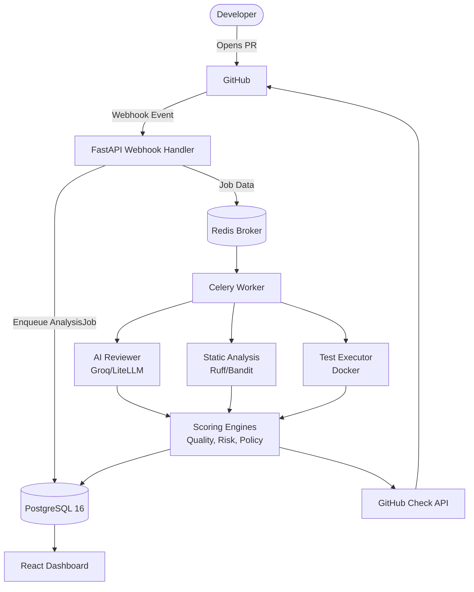

# CodeGate

**AI-Powered Pull Request Quality Intelligence Platform**

CodeGate is a comprehensive Pull Request Quality Intelligence Platform that analyzes Pull Requests using AI-assisted review, static analysis, test evidence, and changed-code coverage. It provides explainable Quality and Risk Scores, Merge Policy evaluation, reviewer recommendations, and an engineering analytics dashboard.

*If you are reviewing this project for a defense or presentation, please start here: [**Final Defense & Documentation Index**](docs/README.md).*

## What CodeGate Does

When a developer opens or updates a Pull Request:
1. **GitHub PR** triggers an event.
2. **GitHub Webhook** is received by CodeGate.
3. **Async Analysis** is enqueued and processed by Celery Workers.
4. **AI Review** evaluates the code changes for bugs, security, and quality issues.
5. **Static Analysis** scans the AST for deterministic flaws.
6. **Tests/Coverage** are evaluated via a safe execution sandbox.
7. **Quality Score & Risk Score** are computed based on findings.
8. **Policy** is evaluated (PASS, WARNING, BLOCK).
9. **Reviewer Recommendation** suggests the best engineers to review the PR.
10. **GitHub Check** is published back to the PR with the results.
11. **Dashboard** visualizes the data and provides engineering analytics.

## Core Features

- **Automated Code Review:** Deterministic static analysis combined with probabilistic AI insights.
- **Quality & Risk Scoring:** Explainable scores mapped to your team's quality gates.
- **Merge Policy Engine:** Blocks, warns, or passes based on strict, configurable evidence.
- **Reviewer Recommendations:** Smart suggestions based on CODEOWNERS, file history, and directory expertise.
- **Full Analytics Dashboard:** React/Vite SPA for exploring PR quality trends and tenant data.
- **Secure Sandbox Testing:** Docker-based execution of repository test suites.

## Architecture

## Technology Stack

- **Backend:** FastAPI, SQLAlchemy, Alembic
- **Database:** PostgreSQL 16
- **Queue:** Redis + Celery
- **Frontend:** React + Vite
- **Runtime:** Docker Compose
- **AI:** PR-Agent foundation + LiteLLM-compatible provider configuration (e.g., Groq)
- **Static Analysis:** Ruff, Bandit, Radon
- **Testing:** DockerTestExecutor

## Requirements

### Normal User Requirements
- Windows 10/11, macOS, or Linux
- [Docker Desktop](https://www.docker.com/products/docker-desktop/) (must be running)
- Internet connection (for GitHub and external AI provider access)
- A GitHub account and repository access

*Note: You do not need Python or Node.js installed to run the packaged product.*

### Developer Requirements
- Python 3.12+
- Node.js 20+
- Git
- Docker Engine / Docker Desktop

## Documentation Quick Links

- [**First Time Setup (Clone & Run Guide)**](docs/FIRST_RUN.md)
- [**Environment Configuration Guide**](docs/CONFIGURATION.md)
- [**Architecture Deep Dive**](docs/ARCHITECTURE.md)
- [**GitHub App Setup**](docs/GITHUB_APP_SETUP.md)
- [**AI Configuration**](docs/AI_CONFIGURATION.md)
- [**Troubleshooting**](docs/TROUBLESHOOTING.md)

## 🤝 Upstream Attribution

CodeGate extends the open-source **PR-Agent** framework.
- **PR-Agent provided**: Foundational LLM wrappers (LiteLLM) and GitHub connection scaffolding.
- **CodeGate implemented**: The persistent PostgreSQL database layer, Static Analysis orchestrators, Quality/Risk scoring, Policy Engine, Reviewer Recommendation, Test execution, React Dashboard, and CI/CD security pipelines.
- CodeGate does not claim authorship over original PR-Agent code.

## 📜 License

MIT License. Upstream copyrights belong to their respective owners. CodeGate-specific additions are licensed under the same terms.
