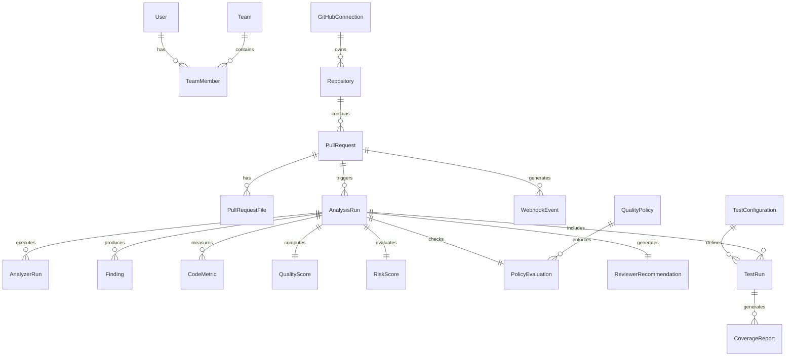

# CodeGate Database Documentation

## ER Diagram

## ORM Entities
- **User / Team / TeamMember**: Role and access management.
- **GitHubConnection / Repository**: Integration states.
- **PullRequest / PullRequestFile**: PR metadata and file changes.
- **WebhookEvent**: Payload persistence and deduplication.
- **AnalysisRun**: The core execution container for a PR update.
- **Finding / AnalyzerRun / CodeMetric**: Static analysis results.
- **QualityScore / RiskScore**: Deterministic grade outputs.
- **QualityPolicy / PolicyEvaluation**: Rules and their evaluation.
- **TestConfiguration / TestRun / CoverageReport**: Testing evidence.
- **ReviewerRecommendationConfig / ReviewerRecommendation / ReviewerRecommendationCandidate**: Reviewer matching.
