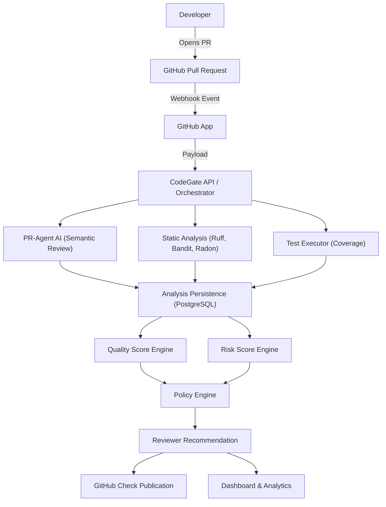
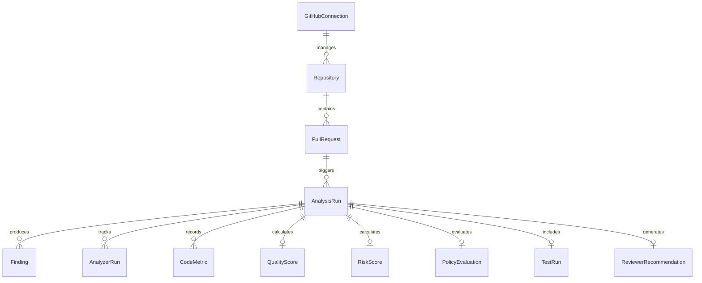

# CodeGate: Final Technical Report

**Project**: CodeGate  
**Version**: 1.0.0  
**Commit**: 59972f5f3b08475c3c849ba902eda5300781812e  

## 1. Introduction
CodeGate is an AI-assisted Pull Request quality intelligence platform that combines AI review, static analysis, testing evidence, explainable quality/risk scoring, merge policy evaluation, reviewer recommendation, GitHub integration, and engineering analytics.

## 2. Problem Statement
Pull Requests contain diverse quality signals. Reviewers must manually inspect code, security, tests, and change risk. Review decisions are difficult to standardize. AI review alone is insufficient because it is probabilistic and can hallucinate. Engineering teams need explainable evidence, consistent merge gates, accurate reviewer recommendations, and historical visibility to make confident merge decisions.

## 3. Objectives
1. Centralize PR quality evidence.
2. Combine probabilistic AI with deterministic static analysis.
3. Produce an explainable Quality Score.
4. Produce an independent Risk Score.
5. Evaluate configurable merge policies.
6. Recommend suitable human reviewers based on expertise history.
7. Integrate results directly into GitHub Check Runs.
8. Visualize engineering health via a real-time dashboard.
9. Support repeatable, secure deployment and testing via Docker and CI/CD.

## 4. Requirements
- **Runtime**: Python 3.12+, Node.js 20+
- **Database**: PostgreSQL 16
- **LLM Provider**: Groq (groq/openai/gpt-oss-120b)
- **Git Provider**: GitHub (via GitHub App Webhooks)
- **Analyzers**: Ruff, Bandit, Radon, Pytest

## 5. Architecture
CodeGate acts as an orchestrator sitting between GitHub, PR-Agent (AI engine), and Deterministic Tools.

## 6. Database (Simplified Data Model)
CodeGate relies on PostgreSQL 16, utilizing SQLAlchemy ORM and Alembic migrations.

## 7. AI Integration
AI is utilized specifically for semantic PR review and explanatory feedback. 
**AI is NOT solely responsible for**: the Quality Score, Risk Score, Merge Policy, or Reviewer Recommendation. By layering deterministic evidence alongside probabilistic AI insights, CodeGate prevents AI hallucination from making unilateral blocking decisions.

## 8. Static Analysis
- **Ruff**: Evaluates Python code quality, style, and static correctness.
- **Bandit**: Discovers Python security vulnerabilities via Abstract Syntax Tree (AST) scanning.
- **Radon**: Computes Cyclomatic Complexity metrics.

## 9. Testing & Coverage
CodeGate evaluates **changed-code coverage**, defined as: `Changed Lines ∩ Executable Lines`.
If a PR changes zero executable lines, the coverage is deemed `null` (N/A), preventing a false 0% or 100% score. Test execution enforces strict trust boundaries via `DisabledExecutor` or `LocalTrustedExecutor` configurations to prevent RCE from arbitrary PR code.

## 10. Quality Score
The Quality Score evaluates the merit of the code.
**Approved Weights**:
- Code Quality: 25%
- Security: 20%
- Testing: 20%
- Complexity: 15%
- Maintainability: 10%
- AI Review: 10%

Missing evidence (e.g., no tests configured) does not default to 0. The weight is redistributed among available dimensions to maintain fair, explainable grading.

## 11. Risk Score
The Risk Score independently evaluates the potential blast radius and danger of a merge.
**Approved Weights**:
- Security: 40%
- Change Surface: 25%
- Sensitive Path: 20%
- Complexity: 15%

*Note: Risk Score is NOT (100 - Quality Score).* A highly secure, perfectly tested PR (Quality=95) modifying the core authentication module will still correctly reflect a high Change Risk.

## 12. Policy Engine
Evaluates evidence against configurable thresholds to yield:
- **PASS**: Success (Merge recommended)
- **WARNING**: Neutral (Merge permitted with caution)
- **BLOCK**: Failure (Merge denied)

*Precedence*: `BLOCK > WARNING > PASS`.
*CodeGate does not automatically merge code. It provides GitHub Check conclusions.*

## 13. Reviewer Recommendation
**Weights**:
- CODEOWNERS: 40%
- Exact File History: 30%
- Directory Expertise: 20%
- Recency: 10%

Excludes bots, inactive users, and the PR author. The recommendation is advisory to assist managers; it is not proof of approval.

## 14. GitHub Integration
Operates securely via a GitHub App using least-privilege token minting. Webhook payloads are verified using SHA-256 HMAC signatures.

## 15. Dashboard
A Vite-based React SPA providing real-time visibility into repositories, active PRs, scoring breakdowns, policies, and historical engineering analytics.

## 16. PostgreSQL / Docker
Containerized production environment defined via `compose.codegate.yml`. Ensures deterministic scaling and prevents cross-contamination between local SQLite development and the production RDBMS stack.

## 17. CI/CD & Security
Hardened GitHub Actions (`codegate-ci.yml`) enforce:
- Dependency Audits (`pip-audit`, `npm audit`)
- Secret Scanning (`gitleaks-action`)
- SAST Analysis (`bandit`, `ruff`)
- API Security (Nginx Headers, CORS, Logging safety)

## 18. Testing Results
- **Backend Tests**: 89/89 (Passed)
- **Frontend Tests**: 17/17 (Passed)
- **PostgreSQL Migrations**: Single linear head (`f18d4f8fc6ca`)
- **Docker Validation**: Clean Compose Config
- **Security Audit**: 0 Blocking Findings

## 19. Limitations
1. No production cloud deployment or native TLS termination currently exists.
2. External AI features depend strictly on Groq API availability.
3. Test execution security depends entirely on the active executor mode trust boundaries.
4. Reviewer expertise relies on past Git history (blind to uncommitted knowledge).
5. GitHub-hosted CI execution requires an external live runner to definitively test E2E push scenarios.

## 20. Future Work
1. Enterprise SSO/RBAC Hardening.
2. Organization-level GitHub deployment with an external Secret Manager.
3. Machine-Learning calibrated risk scoring using enterprise-scale historical datasets.
4. Support for additional Git providers (GitLab, Bitbucket).

## 21. Conclusion
CodeGate successfully bridges the gap between raw AI PR assistance and enterprise-grade merge policies. By centralizing deterministic and probabilistic evidence, CodeGate enables engineering teams to ship code faster with quantifiable confidence.

## 22. Upstream Attribution
CodeGate extends the open-source **PR-Agent** by QodoAI. 
- **PR-Agent provided**: The core GitHub App connection engine, foundational AI prompts, and LiteLLM wrappers.
- **CodeGate implemented**: The persistent PostgreSQL domain model, static analysis orchestrators, Quality/Risk calculation engines, Policy evaluation, Reviewer Recommendation, local Test executors, Dashboard UI, and Docker/CI hardening.
