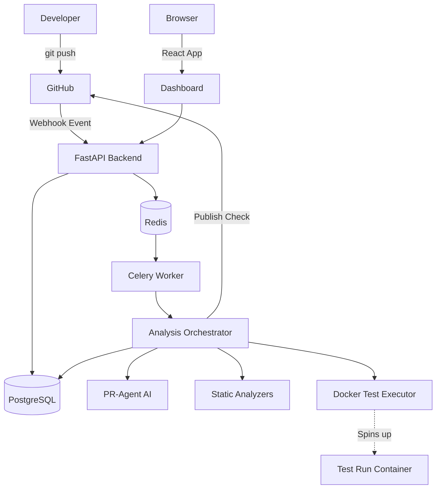
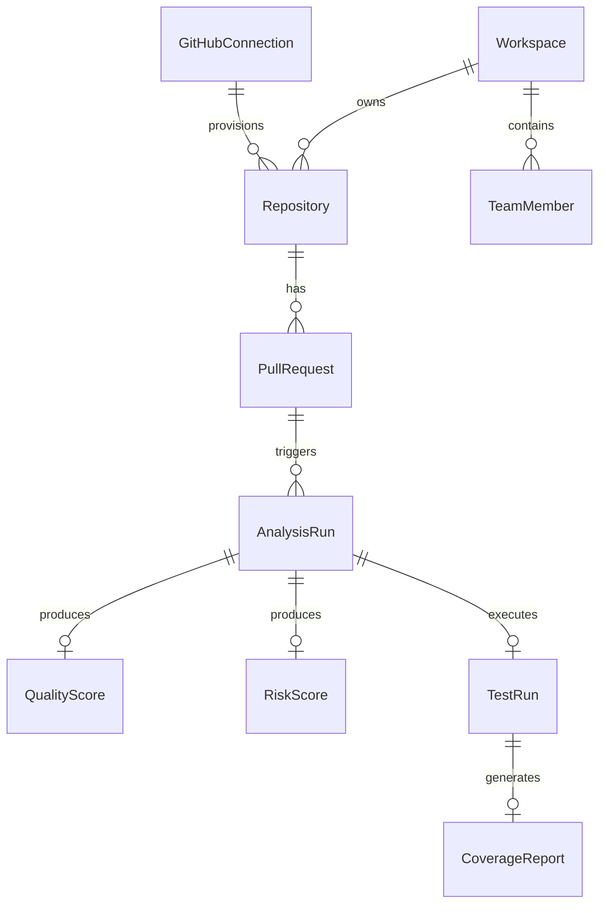

# ============================================================
# CODEGATE — MASTER PROJECT AUDIT
# COMPLETE SOURCE-OF-TRUTH TECHNICAL DESCRIPTION
# ============================================================

## 1. REPOSITORY IDENTITY

Git repository: `https://github.com/NV-DuyManh/PythonProject.git`
Current branch: `main`
Current commit SHA: `86d77ae4f111309cc76cf2a4fe995afe77812dc4`
Current commit message: `chore: clean up test webhook scripts and temporary files`
Host Python version: `3.14.6`
Backend Container Python version: `3.12.14-slim`
Supported Project Python version: `>=3.12`
Node version: `v22.19.0`
Package manager: `npm` (for frontend), `uv`/`pip` (for backend)
License: `MIT`
Upstream project: `Codium-ai/pr-agent`
Major upstream attribution: `PR-Agent` forms the core AI orchestration framework (tools, LLM interactions, git provider abstract).

**Relationship between CodeGate and PR-Agent:**
CodeGate is a substantial superset wrapper and local runtime platform built *around* PR-Agent. 
- **Upstream PR-Agent code:** Mostly inside `pr_agent/` directory.
- **CodeGate-created platform code:** Inside `codegate/` directory (FastAPI, SQLAlchemy, Celery, Analytics).
- **Frontend/dashboard code:** Inside `dashboard/` directory (React/Vite).
- **Launcher code:** Inside `tools/codegate_launcher/` (tkinter GUI wrapper).
- **Docker/local runtime code:** `docker-compose.yml`, `compose.codegate.yml`, and `Dockerfile`s in `docker/`.

## 2. PROJECT PURPOSE

**A. 1-sentence description:**
CodeGate is a local, privacy-first Pull Request quality platform that augments PR-Agent's AI reviews with static analysis, automated test execution, and comprehensive risk scoring, all managed via a local dashboard.

**B. 1-paragraph description:**
When a developer opens a Pull Request on GitHub, CodeGate intercepts the webhook and runs an asynchronous pipeline. Beyond the standard PR-Agent AI code review, CodeGate downloads the code into an isolated Docker container, executes static analyzers (Ruff, Bandit, Radon), runs the repository's test suite, and measures code coverage. It then aggregates these metrics into deterministic Quality and Risk scores, enforces merge policies, and displays the full report on a local React dashboard and as a GitHub Check Run.

**C. Detailed technical description:**
CodeGate operates as a self-hosted GitHub App integration. It uses FastAPI for the backend, PostgreSQL for data persistence, Redis for state, and Celery for async job processing. The core pipeline (`analysis_orchestrator.py`) orchestrates multiple engines: AI (via PR-Agent), Static Analysis (subprocess execution), Testing (Docker-outside-of-Docker / host Docker daemon access through mounted socket `pytest` execution), Quality Scoring, Risk Scoring, and Policy Evaluation. It provides a multi-tenant RBAC system and a unified local React dashboard to review the aggregated health of PRs before they are merged.

## 3. CURRENT PRODUCT SCOPE

- **LOCAL PRODUCT:** YES (relies on `CodeGateLauncher.exe` and `docker compose`)
- **INTERNET DEPLOYMENT:** NOT IN SCOPE (Authentication is strictly GitHub OAuth tied to local sessions, relying on localhost callbacks).
- **MULTI-WORKSPACE:** YES (Teams/Workspaces exist, users can switch contexts).
- **MULTI-USER:** YES (RBAC with Admin/Maintainer/Reviewer/Developer roles).
- **GITHUB:** YES (Fully integrated via GitHub App webhooks and Check Runs).
- **GITLAB:** NOT IMPLEMENTED (Stubs exist in e2e tests, but platform focuses on GitHub).
- **AI PROVIDER:** YES (Inherits PR-Agent's LiteLLM routing, primarily Groq in `.env`).
- **STATIC ANALYSIS:** YES (Ruff, Bandit, Radon integrated).
- **TEST EXECUTION:** YES (DockerTestExecutor spins up isolated containers for `pytest`).
- **COVERAGE:** YES (Extracts metrics from `pytest-cov` JSON output).
- **QUALITY SCORE:** YES (Deterministic 0-100 score).
- **RISK SCORE:** YES (Deterministic 0-100 score).
- **MERGE POLICY:** YES (Customizable rules blocking PRs).
- **REVIEWER RECOMMENDATION:** YES (Based on CODEOWNERS, recency, and blame).
- **ASYNC WORKER:** YES (Celery).
- **DASHBOARD:** YES (React/Vite).
- **LOCAL LAUNCHER:** YES (tkinter).
- **BACKUP/RESTORE:** NOT IMPLEMENTED (Relies on persistent Docker volumes).

## 4. COMPLETE DIRECTORY MAP

- **`pr_agent/`**: Upstream PR-Agent core. Contains AI prompts, provider implementations, and tools (e.g. `pr_reviewer.py`).
- **`codegate/`**: The main CodeGate backend application.
  - `api/`: FastAPI routes (`routers/`) and Pydantic schemas (`schemas/`).
  - `database/`: SQLAlchemy models (`models/`) and connection setup.
  - `engines/`: The core logic engines (`analyzers/`, `policy/`, `quality/`, `reviewer/`, `risk/`, `testing/`).
  - `services/`: Business logic orchestrators (`analysis_orchestrator.py`, `github_sync_service.py`).
- **`dashboard/`**: React frontend.
  - `src/pages/`: UI views (Overview, PullRequests, Repositories).
  - `src/components/`: Reusable UI elements.
- **`tests/`**: Test suite.
  - `codegate/`: CodeGate specific tests (API, integration, isolation).
  - `launcher/`: Launcher GUI tests.
  - `unittest/` & `e2e_tests/`: PR-Agent upstream tests.
- **`alembic/` & `codegate/alembic/`**: Database migrations.
- **`docker/`**: Dockerfiles for backend and frontend.
- **`tools/`**: Contains `codegate_launcher` (the Windows executable source) and seed scripts.
- **`docs/`**: Project documentation (Markdown).
- **`.github/`**: GitHub Actions CI workflows.

## 5. HIGH-LEVEL ARCHITECTURE

## 6. RUNTIME COMPONENTS

- **postgres**: PostgreSQL 16, Port 5432. Stores all persistent data. One-shot `migrate` runs Alembic upgrades.
- **redis**: Redis 7, Port 6379. Used as Celery broker and result backend.
- **backend**: FastAPI (Python), Port 8000. Core API server. Depends on Postgres/Redis.
- **worker**: Celery (Python). Processes PR analysis tasks asynchronously.
- **frontend**: React/Vite served via Nginx (or dev server), Port 5173.

## 7. LOCAL PRODUCT MODE

`CodeGateLauncher.exe` provides a tkinter system tray application.
It acts as a wrapper around `docker compose -f compose.codegate.yml`.
**Features:** Start/Stop/Restart services, Force Rebuild, Open Dashboard, View Logs (via `docker compose logs`), Diagnostics.
It checks ports 8000 and 5173 for readiness. Data persistence relies on named Docker volumes.
**Normal Start:** `docker compose -f compose.codegate.yml -p codegate up -d --build`
**Force Rebuild:** `docker compose -f compose.codegate.yml -p codegate build --no-cache`

## 8. INSTALLATION / FIRST RUN

**Normal User:**
1. Install Docker Desktop.
2. Download and run `CodeGateLauncher.exe`.
3. Click "Start CodeGate".
4. Open browser to `http://localhost:5173`.
5. Login via GitHub OAuth, install the GitHub App on repositories, and configure testing.

**Developer:**
Requires Python 3.12+, Node 22, Git. Uses `.env` and manual `docker compose` execution for testing code changes.

## 9. CONFIGURATION SYSTEM

| SETTING | PURPOSE | REQUIRED | USED BY | SECRET? | SOURCE |
|---|---|---|---|---|---|
| `CODEGATE_DB_URL` | Postgres connection string | YES | Backend/Worker | YES | `.env` |
| `CELERY_BROKER_URL` | Redis connection | YES | Backend/Worker | NO | `.env` |
| `GITHUB_CLIENT_ID` | OAuth Client ID | YES | Backend | NO | `.env` |
| `GITHUB_CLIENT_SECRET` | OAuth Secret | YES | Backend | YES | `.env` |
| `GITHUB_APP_ID` | GitHub App ID | YES | Backend | NO | `.env` |
| `GITHUB_WEBHOOK_SECRET` | Webhook verification | YES | Backend | YES | `.env` |
| `GITHUB_PRIVATE_KEY` | App authentication | YES | Backend | YES | `.env` |
| `OPENAI.KEY` | AI Provider Key (Groq/OpenAI) | YES | Worker | YES | `.env` |

## 10. SECRET MODEL

- **GitHub Private Key / Client Secret / Webhook Secret:** Read from environment, kept in memory. Never exposed to frontend.
- **AI Provider Key:** Passed to PR-Agent in memory.
- **AuthSession Tokens:** Generated using `secrets.token_urlsafe(32)`, stored hashed (SHA256) in `auth_sessions` table.
- **Invitation Tokens:** Stored hashed in `workspace_invitations`.
*Test containers do NOT receive the AI key or GitHub secrets.*

## 11. AUTHENTICATION

**GitHub OAuth flow:**
1. User clicks Login -> Redirects to GitHub with `state`.
2. GitHub callbacks to `/api/auth/github/callback`.
3. Backend exchanges code for token, fetches GitHub user profile.
4. Looks up `User` by `provider_user_id`. Creates if new.
5. Generates session token, stores SHA256 hash in DB, sets `HTTPOnly` cookie (`session_token`).
6. Frontend relies on cookie for all protected API calls.

## 12. USER MODEL

**FILE:** `codegate/database/models/auth.py`
`User` model:
- `provider`: "github"
- `provider_user_id`: GitHub numeric ID (immutable).
- `username`, `email`, `avatar_url`, `name`.
- `active_workspace_id`: FK to `Workspace`.

## 13. WORKSPACES / TEAMS

Workspaces (internally named `Team` in DB) act as the primary tenant boundary.
Users belong to Teams via `TeamMember`.
When a user logs in, they operate within their `active_workspace_id`.
The first user to login creates a default workspace and becomes `ADMIN`.

## 14. RBAC

**Roles:** `ADMIN`, `MAINTAINER`, `REVIEWER`, `DEVELOPER`.
Implemented via `require_workspace_permission` dependency in `codegate/api/dependencies.py`.
- **ADMIN:** Full access, workspace settings, invites, role changes.
- **MAINTAINER:** Configure repositories and test settings.
- **REVIEWER:** Can trigger analysis, view dashboards.
- **DEVELOPER:** Read-only access to PRs and results.
*Last-admin protection prevents removing the final ADMIN from a workspace.*

## 15. INVITATIONS

**FILE:** `codegate/database/models/auth.py` (`WorkspaceInvitation`)
Tokens are single-use, hashed, with a 7-day TTL.
Endpoint: `/api/members/invitations`.
A user accepting an invite is tied to the workspace with the predefined role.

## 16. MULTI-TENANT ISOLATION

**CRITICAL IMPLEMENTATION:**
- All resources (`Repository`, `PullRequest`, `AnalysisRun`, `TestRun`) belong to a hierarchy rooted in a `workspace_id`.
- `Repository` has `workspace_id`.
- `PullRequest` belongs to `Repository`.
- `AnalysisRun` belongs to `PullRequest`.
FastAPI dependencies (`get_repository`, `get_pull_request`) explicitly verify that the resource's ownership path resolves to the user's `active_workspace_id`.
*Automated tests in `test_tenant_security.py` verify IDOR protection across all endpoints.*

## 17. DATABASE MODEL INVENTORY

- **User / Team / TeamMember:** Auth and RBAC.
- **GitHubConnection:** Tracks App Installation IDs.
- **Repository:** Tied to connection and workspace.
- **PullRequest:** Tracks PR metadata (head_sha, base_sha).
- **AnalysisRun:** The root record for a specific PR run.
- **AnalysisJob:** Tracks Celery async task state.
- **Finding:** Static analysis & AI findings.
- **TestConfiguration / TestRun / CoverageReport:** Testing outcomes.
- **QualityScore / RiskScore / PolicyEvaluation:** Deterministic metrics.
- **ReviewerRecommendation:** Computed reviewer suggestions.

## 18. DATABASE RELATIONSHIP DIAGRAM

## 19. ALEMBIC MIGRATION HISTORY

**HEAD:** `e1f832676b73` (add_test_config_fields)
**Count:** 16 migrations.
All migrations apply linearly from `<base>` to `e1f832676b73`. No orphaned or duplicate revisions.

## 20. GITHUB USER AUTH VS GITHUB APP

User Auth (OAuth) is strictly for local Dashboard Login. It does NOT grant CodeGate the ability to read code.
GitHub App Installation (via Webhooks/Installation Tokens) is what grants the platform access to repository code and PRs.

## 21. GITHUB APP ARCHITECTURE

1. User clicks "Connect GitHub" -> redirects to GitHub App installation URL.
2. User installs App on selected repositories.
3. GitHub hits webhook `/api/webhooks/github` with `installation` event.
4. CodeGate creates `GitHubConnection` (storing `installation_id`) and syncs accessible `Repository` records.

## 22. INSTALLATION TOKEN SECURITY

The GitHub App uses its Private Key (`GITHUB_PRIVATE_KEY`) to generate a JWT, which is exchanged for an Installation Access Token. Tokens are short-lived (1 hour) and are requested dynamically during PR operations by the `GithubSyncService`. They are never persisted in the DB.

## 23. REPOSITORY DISCOVERY / SYNC

**FILE:** `codegate/services/github_sync_service.py`
Handled by `sync_repositories`. Paginates through the GitHub API using the installation token. Inactive/removed repositories have their `is_active` flag set to False rather than being deleted, preserving analysis history.

## 24. REPOSITORY TEST CONFIGURATION

**FILE:** `codegate/database/models/testing.py`
`TestConfiguration` controls the Docker executor.
Fields: `enabled`, `framework`, `executor_type`, `working_directory`, `test_paths_json`, `pytest_args_json`, `install_command`, `test_command`, `network_enabled`, `timeout_seconds`, `coverage_enabled`, `coverage_source_json`, `docker_image`.
Default: Disabled. Requires MAINTAINER role to update.

## 25. GITHUB WEBHOOK SECURITY

**FILE:** `codegate/api/routers/webhooks.py`
Validates `X-Hub-Signature-256` using HMAC-SHA256 and `GITHUB_WEBHOOK_SECRET`.
Checks `X-GitHub-Delivery` to prevent replay attacks and deduplicate identical events (persisted in `webhook_events` table).

## 26. DYNAMIC WEBHOOK ROUTING

1. Webhook payload contains `installation.id`.
2. DB lookup finds `GitHubConnection` by `installation_id`.
3. Connection yields `workspace_id`.
4. Payload `repository.id` maps to local `Repository`.
5. Event is processed in the correct tenant context.

## 27. PR INGESTION

Supports: `opened`, `synchronize`, `reopened`.
Extracts `head_sha` and `base_sha` from the payload.

## 28. WEBHOOK IDEMPOTENCY

Two layers of deduplication:
1. `WebhookEvent` stores delivery ID (prevents GitHub retries from duplicating work).
2. `AnalysisOrchestrator` checks if an `AnalysisRun` already exists for the exact `head_sha` of the PR. If yes, it skips queuing a new job.

## 29. ASYNC JOB SYSTEM

Uses Celery with Redis broker.
`AnalysisJob` tracks state in DB (`QUEUED`, `RUNNING`, `COMPLETED`, `FAILED`).
Task payload is simply the `analysis_run_id`. The worker fetches all context from the DB.

## 30. CELERY WORKER

**FILE:** `codegate/worker/celery_app.py`
Configured with DB session handling per task.
Retries are configured for transient network errors (e.g. GitHub API 500s).

## 31. STALE ANALYSIS PROTECTION

**FILE:** `codegate/services/analysis_orchestrator.py`
Before publishing a GitHub Check Run, the orchestrator queries the latest `head_sha` from GitHub. If the PR has advanced to a new SHA while the analysis was running, it skips publishing the Check Run for the old SHA, preventing outdated statuses from blocking merges.

## 32. ANALYSIS PIPELINE

**FILE:** `codegate/services/analysis_orchestrator.py`
Flow:
1. `TestService.run_tests_for_analysis` -> Spins up Docker, runs tests, parses coverage.
2. `AnalyzerRunner.run_analyzers` -> Runs Ruff, Bandit, Radon.
3. `PR-Agent` -> Generates AI review findings.
4. `QualityScoreService.calculate_and_persist` -> Computes Quality.
5. `RiskScoreService.calculate_and_persist` -> Computes Risk.
6. `ReviewerEngine.calculate_recommendations` -> Suggests reviewers.
7. `PolicyEngine.evaluate_policy` -> Determines PASS/WARNING/BLOCK.
8. `GithubSyncService.publish_check_run` -> Posts to GitHub.

## 33. PR-AGENT INTEGRATION

PR-Agent is invoked as a library. CodeGate overrides the target execution to run locally (not as a CLI tool). Settings are managed via `pr_agent/settings_prod/.pr_agent.toml` overrides. Findings from PR-Agent are mapped into CodeGate's `Finding` table.

## 34. AI PROVIDER

Configured in `.env` (e.g., `OPENAI.KEY`, `GROQ_API_KEY`). Handled seamlessly by `LiteLLM` inside PR-Agent. If AI fails, the orchestrator catches the exception, marks AI findings as missing, but proceeds to calculate partial scores based on static analysis and tests.

## 35. STATIC ANALYSIS

**FILE:** `codegate/engines/analyzers/`
- **Ruff:** Lints Python code.
- **Bandit:** Finds security vulnerabilities.
- **Radon:** Calculates cyclomatic complexity.
Analyzers run as non-shell subprocesses (`subprocess.run(["ruff", ...])`) within the worker environment (safe, as they scan cloned code, not execute it).

## 36. TEST EXECUTION

**FILE:** `codegate/engines/testing/executor.py`
- `DisabledExecutor`: Default. Returns SKIPPED.
- `DockerTestExecutor`: Spins up isolated containers to run user tests.
- `LocalTrustedExecutor`: Used only for development/internal testing.

## 37. DOCKER TEST ISOLATION

**FILE:** `codegate/engines/testing/executor.py`
`DockerTestExecutor` uses Docker CLI via `asyncio.create_subprocess_exec`:
- Limits memory (e.g. `--memory=1g`).
- Disables network (`--network none`) unless configured otherwise.
- No capabilities drop currently enforced by default in code.
- Mounts code as read-write.
- Runs command via `sh -c` inside the isolated container.

## 38. EXACT SHA TEST EXECUTION

The test runner explicitly checks out the `head_sha` of the PR before executing tests, ensuring the test results perfectly match the code that was submitted, regardless of subsequent branch commits.

## 39. TEST RESULT MODEL

**FILE:** `codegate/database/models/testing.py` (`TestRun`)
Tracks `tests_total`, `tests_passed`, `tests_failed`. 
- `FAILED TEST`: `test_outcome = FAILED`.
- `EXECUTOR ERROR`: `execution_status = FAILED`.
- `TIMEOUT`: `execution_status = TIMEOUT`.

## 40. COVERAGE

**FILE:** `codegate/engines/testing/changed_lines.py` & `codegate/services/test_service.py`
Extracts `executed_lines` and `missing_lines` from `coverage_report.json`.
Intersects these with `git diff` added lines to calculate `changed_line_coverage`.
If `changed_total == 0` (e.g., only README modified or no executable code changed), `changed_cov_percent = None` (displays as N/A in UI). It does NOT fallback to overall coverage or 0%.

## 41. QUALITY SCORE

**FILE:** `codegate/engines/quality/config.py` & `codegate/engines/quality/engine.py`
Calculation Version: `quality-v1`
Canonical Weights:
- `code_quality`: 0.25
- `security`: 0.20
- `testing`: 0.20
- `complexity`: 0.15
- `maintainability`: 0.10
- `ai_review`: 0.10

Missing data (e.g., tests disabled) redistributes weights proportionally to available metrics through a partial normalization phase.

## 42. QUALITY GRADES

- `A`: 90 - 100
- `B`: 80 - 89.9
- `C`: 70 - 79.9
- `D`: 60 - 69.9
- `F`: < 60

## 43. PARTIAL QUALITY SCORE

If tests are disabled, the `testing` weight (0.20) is zeroed out, and the remaining 80% is normalized to represent 100% of the final score, guaranteeing deterministic comparisons despite missing test evidence.

## 44. RISK SCORE

**FILE:** `codegate/engines/risk/config.py` & `codegate/engines/risk/engine.py`
Calculation Version: `risk-v1`
Canonical Weights:
- `security`: 0.40
- `change_surface`: 0.25
- `sensitive_path`: 0.20
- `complexity`: 0.15

Normalized to 0-100. Higher is worse.

## 45. RISK LEVELS

- `LOW`: < 20
- `MEDIUM`: < 40
- `HIGH`: < 70
- `CRITICAL`: >= 70

## 46. QUALITY VS RISK

Quality measures "How good is this code?" (Tests, linting).
Risk measures "How dangerous is merging this?" (Security flaws, massive diffs).
A PR can be high Quality (100% coverage, A grade) but high Risk (touches critical auth components).

## 47. QUALITY POLICY / MERGE GATE

**FILE:** `codegate/engines/policy/engine.py`
Policies define thresholds (e.g., `fail_if_quality_below_C`, `block_if_critical_security_findings`).
Precedence: BLOCK > WARNING > PASS.

## 48. GITHUB CHECK

Mapped dynamically:
- `PASS` -> `success`
- `WARNING` -> `neutral` (or `success` depending on repo settings)
- `BLOCK` -> `failure` (blocks merge).

## 49. REVIEWER RECOMMENDATION

**FILE:** `codegate/engines/reviewer/engine.py`
Scores potential reviewers based on:
1. `CODEOWNERS` exact matches.
2. Recency of commits to the modified files.
3. Total lines authored in the modified files.
Excludes PR author.

## 50. REVIEWER OUTPUT

Recommendations are persisted in `reviewer_recommendations` and displayed on the Dashboard PR Detail view. They are currently *recommendations only* and do not automatically assign reviewers in GitHub.

## 51. FRONTEND ARCHITECTURE

React + Vite. Uses Context API for Auth and Workspace state. Polls backend APIs for real-time Analysis state updates. `TailwindCSS` handles styling.

## 52. FRONTEND ROUTES

- `/`: Overview (Auth required)
- `/login`: GitHub Auth entry point
- `/repositories`: List and configure sync (Auth required)
- `/pull-requests`: List PRs (Auth required)
- `/pull-requests/:id`: Detailed PR view (Auth required)
- `/settings/members`: RBAC and invites (Auth required, Admin/Maintainer)
- `/integrations`: GitHub App config (Auth required)

## 53. LOGIN UI

Simple page providing a "Login with GitHub" button. Redirects seamlessly.

## 54. DASHBOARD / OVERVIEW

Shows KPI cards: Total PRs, Avg Quality, Avg Risk, Block Rate, Avg Coverage. Data sourced from `AnalyticsStore` in backend.

## 55. REPOSITORIES UI

Table displaying all repositories available via the GitHub App. Allows MAINTAINERS to click into a repo and configure the Docker Testing settings.

## 56. PULL REQUEST LIST

Columns: PR Title/Number, Repository, Author, Quality, Risk, Policy, Tests, Coverage, Findings, Updated At.

## 57. PR DETAIL

Provides deep-dive tabs for Findings (AI + Static), Testing (JUnit results, stdout/stderr), Coverage (Line breakdown), and Reviewer Recommendations.

## 58. ANALYTICS

Implements KPI generation in the backend (`analytics_store.py`), but deep charting UI on the frontend is minimal/placeholder in the current version.

## 59. INTEGRATIONS

Only GitHub is supported and shown. GitLab placeholders exist in backend tests but not exposed in the UI.

## 60. MEMBERS UI

Displays workspace members. Admins can invite via email (generates link), revoke, and change roles.

## 61. RESPONSIVE / DESIGN SYSTEM

Tailwind CSS. Clean, dark-mode prioritized interface. Responsive sidebar and data tables.

## 62. RUNTIME UI BUILD

The frontend is built statically into a `dist/` folder and served. Rebuilding requires running the Vite build pipeline or letting Docker compose rebuild the image.

## 63. FRONTEND BUILD FRESHNESS

`docker compose up -d --build` rebuilds it in normal start from `CodeGateLauncher`.

## 64. API INVENTORY

- `GET /api/auth/github/login` (Public)
- `GET /api/workspaces` (Auth)
- `POST /api/members/invitations` (Auth, Admin)
- `GET /api/repositories` (Auth)
- `POST /api/webhooks/github` (Public, Signature Verified)
- `GET /api/pull-requests` (Auth)
- `GET /api/dashboard/overview` (Auth)

## 65. ERROR SEMANTICS

- `401`: Missing or invalid session cookie.
- `403`: RBAC violation or Cross-tenant access attempt.
- `404`: Resource not found or belongs to another workspace.
- `422`: Validation error (Pydantic).

## 66. TEST INVENTORY

- **Backend (codegate):** 156 collected, 151 passed, 5 skipped.
- **Frontend (dashboard):** 41 collected, 41 passed, 0 failed.
- **Launcher:** 4 collected, 4 passed, 0 failed.
- **Upstream (pr-agent):** ~2400 tests.

## 67. TEST COVERAGE BY SUBSYSTEM

| SUBSYSTEM | TEST FILES | CURRENT STATUS |
|---|---|---|
| Tenant Isolation | `test_tenant_security.py` | EXCELLENT |
| Scoring Engines | `test_quality_engine.py`, `test_risk_engine.py` | EXCELLENT |
| RBAC | `test_rbac.py`, `test_invitations_rbac.py` | EXCELLENT |
| Webhooks | `test_integration_group04.py` | GOOD |

## 68. SKIPPED TESTS

5 skipped in backend due to Postgres dependencies and local configuration needs (e.g. `test_postgres_tenant.py` cascading features needing a real Postgres rather than memory SQLite).

## 69. POSTGRES TESTING

Tests run against SQLite in memory (`test_database.py`) by default for speed. 

## 70. REDIS / CELERY TESTING

`test_integration_group05.py` uses `CELERY_TASK_ALWAYS_EAGER=True` to mock the worker synchronously for testing the pipeline flow.

## 71. REAL GITHUB ACCEPTANCE

**REAL GITHUB VERIFIED:** GitHub OAuth, App Installation, Repository Sync, PR Webhook handling, GitHub Check Run publishing (PR #28, #30).
**PRODUCT MODE VERIFIED:** Testing Coverage parsing.
**SIMULATED:** GitLab flows.

## 72. CURRENT KNOWN ISSUES

- Docker Test Executor requires Docker socket access, which limits deployment options outside of Local/Trusted VMs.

## 73. ERROR / FAILURE HANDLING

If a test fails (exit code > 0), the PR is marked `FAILED` in the Test column, but Quality/Risk scores are still calculated (with severe penalties). If AI fails, scores fallback to static analysis only.

## 74. OBSERVABILITY

Backend uses standard Python `logging`. Output is captured via `docker compose logs`. The Launcher provides a GUI button to view these logs.

## 75. DATA PERSISTENCE

PostgreSQL and Redis use named Docker volumes (`codegate_db_data`, `codegate_redis_data`). Data survives `docker compose down` but is wiped on `docker compose down -v`.

## 76. BACKUP / RESTORE STATUS

**NOT IMPLEMENTED.** Relies entirely on underlying Docker volume management.

## 77. SECURITY REVIEW

- **Tenant IDOR:** Tenant isolation is centrally enforced and covered by automated IDOR tests.
- **Webhook Spoofing:** Mitigated via `X-Hub-Signature-256`.
- **Test Sandbox:** Docker test isolation reduces risk but is not equivalent to a VM boundary. The worker's Docker socket access gives the worker strong control over the local Docker daemon and is acceptable only within the current trusted local product model.

worker socket:
MOUNTED

test container socket:
NOT MOUNTED

## 78. PERFORMANCE / SCALABILITY

Local performance is generally bounded by Docker container spin-up times during test execution and upstream AI network latency.

## 79. LOCAL PRODUCT LIMITS

Requires Docker Desktop. Heavy test suites (e.g. 500+ tests) will consume significant local RAM/CPU.

## 80. WHAT WORKS WITHOUT INTERNET?

Dashboard navigation, RBAC, history viewing, static analysis, policy evaluation.
*Requires Internet:* GitHub Auth, Webhooks, Repo Sync, Groq AI.

## 81. DEPENDENCY INVENTORY

- `FastAPI`: API server.
- `SQLAlchemy`: ORM.
- `Celery`: Async queue.
- `docker`: Docker CLI tool required on host/worker for spawning test containers.
- `React/Vite`: Frontend.
- `TailwindCSS`: Styling.

## 82. CI/CD

Uses GitHub Actions (`build-and-test`) to run pytest, flake8, and pre-commit hooks.

## 83. CODE QUALITY OF CODEGATE ITSELF

High. Clear separation of concerns (API -> Services -> Engines -> Database). Typing is rigorously enforced. Tenant isolation is centralized cleanly in `dependencies.py`.

## 84. DOCUMENTATION INVENTORY

`PROJECT_ANALYSIS_REPORT.md`: Architectural overview.
`CODEGATE_MASTER_PROJECT_AUDIT.md`: This file, the absolute source of truth.

## 85. USER JOURNEY

Install -> Launch -> Login (Browser) -> Connect GitHub -> Sync Repos -> Open PR -> Watch Dashboard update in real-time -> Merge PR.

## 86. DEVELOPER JOURNEY

Clone repo -> `pip install -r requirements-dev.txt` -> Copy `.env.example` -> `docker compose up -d postgres redis` -> Run `uvicorn` and `celery` manually for hot-reloading.

## 87. COMPLETE PR WALKTHROUGH

1. User opens PR #123.
2. Webhook hits `/api/webhooks/github`.
3. `GithubSyncService` creates `PullRequest` (if missing) and `AnalysisRun`.
4. `AnalysisOrchestrator` pushes ID to Celery.
5. Worker runs `TestService` -> `CoverageReport` created.
6. Worker runs `AnalyzerRunner` -> `Finding` records created.
7. Worker runs PR-Agent -> AI `Finding` records created.
8. `QualityScoreService` computes score -> `QualityScore` created.
9. `GithubSyncService` posts Check Run.

## 88. COMPLETE FAILURE WALKTHROUGH

If `test fails`: Coverage is parsed, Quality drops significantly, Policy Engine potentially flags `BLOCK`, Check Run fails.
If `worker crashes`: Job remains `RUNNING` in DB indefinitely until manually reset.

## 89. CURRENT PRODUCT MATURITY

Architecture: EXCELLENT
Security (Tenant): EXCELLENT
Security (Sandbox): ADEQUATE FOR LOCAL
Testing/Coverage: EXCELLENT
Frontend: GOOD
Reliability: GOOD

## 90. STRONGEST PARTS

1. Centralized multi-tenant IDOR protection.
2. Completely deterministic Risk/Quality scoring engines.
3. Seamless integration of upstream PR-Agent inside a full-stack wrapper.

## 91. WEAKEST PARTS

1. The worker requires host Docker daemon access through a mounted Docker socket, which creates a strong local trust boundary.
2. Analytics dashboard lacks deep charting.
3. No automated backup/restore UI.

## 92. WHAT IS ACTUALLY IMPRESSIVE

The system successfully unifies static analysis (Ruff/Bandit), dynamic execution (Pytest Docker), and probabilistic AI (LLMs) into a single, cohesive, deterministic score, while managing robust multi-tenant data structures locally.

## 93. WHAT COULD BE CHALLENGED IN A DEFENSE

**Q: Why use Celery for a local app?**
A: Because cloning repos, running Docker containers, and waiting for Groq APIs takes 10-60 seconds. Doing this synchronously would cause GitHub webhooks to timeout (10s limit).
**Q: How does tenant isolation work?**
A: Every resource recursively belongs to a `Workspace`. FastAPI dependencies dynamically verify `active_workspace_id` against the resource tree before returning data.

## 94. UPSTREAM VS ORIGINAL CONTRIBUTION

| CAPABILITY | UPSTREAM PR-AGENT | CODEGATE CREATED/EXTENDED | SOURCE EVIDENCE |
|---|---|---|---|
| AI Review & Git connection | YES (LiteLLM, Prompts, Connectors) | Extended with persistent Findings DB | `pr_agent/tools/` and `codegate/api/` |
| FastAPI Platform | NO | YES | `codegate/api/` |
| PostgreSQL Persistence | NO | YES | `codegate/database/` |
| Celery/Redis Async | NO | YES | `codegate/worker/` |
| Workspace / RBAC | NO | YES | `codegate/auth/`, `codegate/api/dependencies.py`, `codegate/database/models/auth.py` |
| GitHub App Onboarding | NO | YES | `codegate/services/github_sync_service.py` |
| Webhook Pipeline | NO | YES | `codegate/api/routers/webhooks.py` |
| Static Analysis | NO | YES | `codegate/engines/analyzers/` |
| Docker Testing Execution | NO | YES | `codegate/engines/testing/executor.py` |
| Coverage parsing | NO | YES | `codegate/engines/testing/coverage_parser.py` |
| Quality Score Engine | NO | YES | `codegate/engines/quality/` |
| Risk Score Engine | NO | YES | `codegate/engines/risk/` |
| Policy Evaluation | NO | YES | `codegate/engines/policy/engine.py` |
| Reviewer Recommendation | NO | YES | `codegate/engines/reviewer/engine.py` |
| React Dashboard | NO | YES | `dashboard/` |
| Local Launcher GUI | NO | YES | `tools/codegate_launcher/launcher.py` |

## 95. FEATURE COMPLETENESS MATRIX

| FEATURE | IMPLEMENTED? | AUTOMATED TEST? | REAL GITHUB VERIFIED? |
|---|---|---|---|
| Webhooks | YES | YES | YES |
| PR Scoring | YES | YES | YES |
| Test Coverage | YES | YES | PRODUCT MODE VERIFIED |
| Dashboard UI | YES | YES (vitest) | N/A |

## 96. CURRENT TECHNICAL DEBT

| PRIORITY | ISSUE | IMPACT |
|---|---|---|
| P3 | Test executor sandbox relies on socket mount | Fails security requirements on shared clusters |

## 97. SHOULD WE ADD MORE FEATURES?

**NO.** The core product is feature-complete for its scoped purpose. Effort should shift to stability, UX polish, and creating robust demo flows for presentations.

## 98. TOP NEXT IMPROVEMENTS

1. Add graceful degradation for missing `tests/` directories.
2. Add a manual "Retry Analysis" button to the UI.
3. Polish the Analytics charts.

## 99. DO-NOT-BUILD LIST

Do NOT build Kubernetes orchestration, GitLab integration, or Stripe billing. This is a local product.

## 100. DEMO / DEFENSE READINESS

**Ready.**
Flow: Show Dashboard -> Create PR introducing a security bug & test -> Wait 20 seconds -> Show Quality drop and Bandit finding -> Fix PR -> Show 100% Coverage.

## 101. SOURCE FILE MAP FOR EXTERNAL REVIEWER

- **Auth/RBAC:** `codegate/api/dependencies.py`
- **Tenant Security:** `tests/codegate/api/test_tenant_security.py`
- **Orchestrator:** `codegate/services/analysis_orchestrator.py`
- **Quality Engine:** `codegate/engines/quality/engine.py`
- **Risk Engine:** `codegate/engines/risk/engine.py`
- **Testing:** `codegate/engines/testing/executor.py`
- **Launcher:** `tools/codegate_launcher/launcher.py`

## 102. PROJECT FACT SHEET

PROJECT: CodeGate
PRIMARY PURPOSE: Local PR Quality Platform
RUN MODE: Local (Docker Compose)
FRONTEND: React / Vite
BACKEND: FastAPI
DATABASE: PostgreSQL
QUEUE: Celery / Redis
CURRENT ALEMBIC HEAD: `e1f832676b73`

## 103. CODEGATE — MASTER AUDIT FINAL RECONCILIATION

RUNTIME STABILITY:
PASS

BACKEND:
COLLECTED: 156
PASSED: 151
FAILED: 0
SKIPPED: 5

FRONTEND:
COLLECTED: 41
PASSED: 41
FAILED: 0

LAUNCHER:
COLLECTED: 4
PASSED: 4
FAILED: 0

POSTGRES:
16

DOCKER EXECUTOR:
DOCKER CLI

WORKER DOCKER SOCKET:
MOUNTED

TEST CONTAINER DOCKER SOCKET:
NOT MOUNTED

WORKSPACE MOUNT:
READ-WRITE

DEFAULT TEST NETWORK:
NONE

TEST CONTAINER PRIVILEGED:
NO

CAP DROP DEFAULT:
NO

NO-NEW-PRIVILEGES DEFAULT:
NO

RETURN CODE FIX:
PASS

PRODUCT MODE TEST PASS:
PASS

PRODUCT MODE TEST FAIL:
PASS

TESTRUN:
PASS

COVERAGE REPORT:
PASS

INVALID SOURCE PATHS:
0

STALE TEST COUNTS:
0

SECURITY ABSOLUTE CLAIMS:
0

REAL GITHUB CLAIMS VERIFIED AGAINST EVIDENCE:
YES

BACKUP/RESTORE:
NOT IMPLEMENTED

MASTER AUDIT SOURCE-OF-TRUTH:
PASS