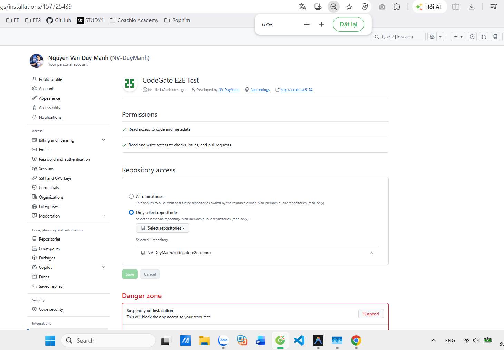

# CodeGate GitHub App Setup Guide

This guide details the exact process for creating and configuring the GitHub App required to integrate CodeGate with your repositories.

## 1. Create the GitHub App

1. Go to your GitHub account or organization settings:
   - **Personal**: Settings -> Developer settings -> GitHub Apps -> **New GitHub App**
   - **Organization**: Settings -> GitHub Apps -> **New GitHub App**

2. Fill out the basic information:
   - **GitHub App name**: `CodeGate Local` (or any unique name)
   - **Homepage URL**: `https://github.com/Codium-ai/pr-agent` (or your local dashboard URL if preferred)
   - **Callback URL**: Leave blank (not required for backend-to-backend integration)

## 2. Webhook Configuration

CodeGate requires webhooks to synchronize Pull Request events automatically.

- **Active**: Ensure the checkbox is checked.
- **Webhook URL**: Enter your public `ngrok` URL followed by `/api/v1/github_webhooks` 
  - *Example*: `https://1234-56-78-90-12.ngrok-free.app/api/v1/github_webhooks`
- **Webhook secret**: Create a secure random string (e.g., `codegate-secret-2026`). You will need to provide this to the backend.

## 3. Permissions

The permissions below represent the **minimum privilege** required by CodeGate's static analysis, AI orchestration, and feedback mechanisms.

### Repository Permissions
- **Contents**: **Read-only** 
  - *Reason*: CodeGate must read files, commits, and diffs to perform static analysis and AI reviews.
- **Pull requests**: **Read and write**
  - *Reason*: CodeGate must read PR metadata and publish AI reviews/inline comments to the Pull Request.
- **Checks**: **Read and write**
  - *Reason*: CodeGate publishes its comprehensive Quality/Risk/Policy decision as a formal GitHub Check Run on the PR.
- **Issues**: **Read and write**
  - *Reason*: Required as PR comments are often handled by GitHub's underlying Issue Comments API.
- **Metadata**: **Read-only** 
  - *(Default, required to list repositories and basic information)*.

*Note: CodeGate DOES NOT require access to Secrets, Actions, Administration, or Members.*

## 4. Subscribe to Events

Under "Subscribe to events", check the following:
- **Pull request**: Required to trigger analysis on `opened` and `synchronize` (new commits).
- **Check run** / **Check suite**: (Optional) For future re-run triggers.
- **Issue comment**: (Optional) If you intend to use PR-Agent slash commands (e.g., `/review`, `/improve`).

## 5. Install and Generate Secrets

1. Click **Create GitHub App**.
2. Note your **App ID**.
3. Scroll down to **Private keys** and click **Generate a private key**. A `.pem` file will download automatically.
4. On the left sidebar, click **Install App**.
5. Install it on your safe, disposable test repository (e.g., `codegate-e2e-demo`).
6. Once installed, the URL will look like `https://github.com/settings/installations/12345678`. Note the **Installation ID** (`12345678`).

## 6. Information Needed for the Backend

Once completed, please provide the following to the agent (do not commit them to the repository):

1. `GITHUB_APP_ID`
2. `GITHUB_APP_PRIVATE_KEY` (The content of the `.pem` file)
3. `GITHUB_WEBHOOK_SECRET`
4. `GITHUB_INSTALLATION_ID` (for the test repository)
